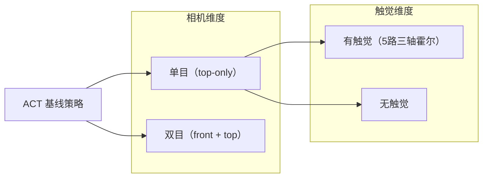
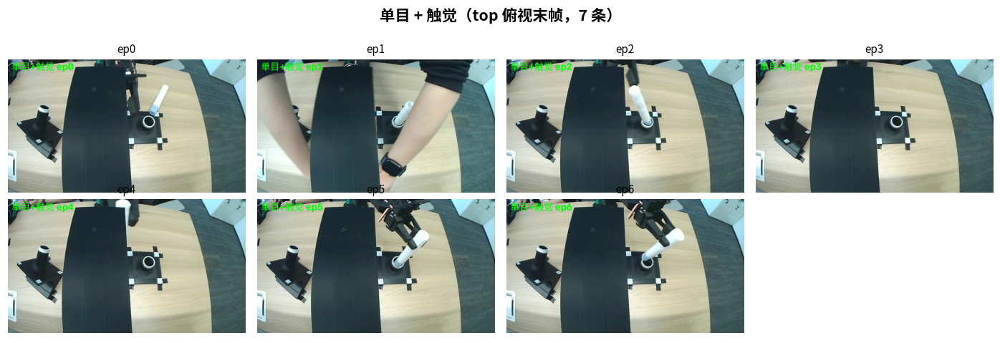
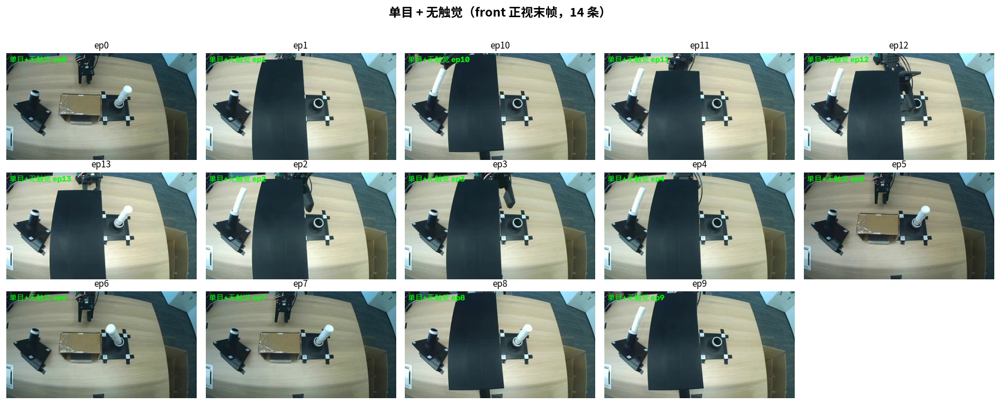
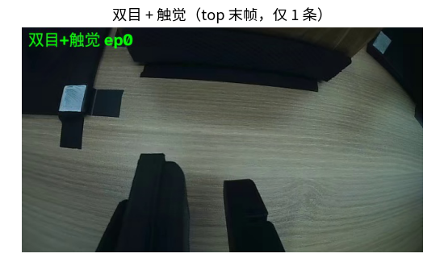

# 圆柱插入任务消融对比报告（ACT 基线）

> 日期：2026-09-04　|　状态：**初稿（FastWAM 结果待云端训练完成后补入）**
> 任务：*Remove the tilted cylinder, adjust its orientation, then insert it upright into the fixed position*（圆柱插入）
> 目的：对比「单目 vs 双目」「有触觉 vs 无触觉」对圆柱插入任务的影响，为 FastWAM 触觉世界模型提供 ACT 基线参照。

---

## 1. 摘要

在 SO-101 真机上用 ACT 策略完成了三组消融 rollout，共 22 个 episode：

| 配置 | episode 数 | 总帧 | 均时长 | 触觉接触比例 | 触觉有效 |
|---|---|---|---|---|---|
| 双目 + 触觉 | 1 | 621 | 20.7s | 0.673 | 1.00 |
| 单目 + 触觉 | 7 | 3723 | 17.7s | 0.709 | 1.00 |
| 单目 + 无触觉 | 14 | 8859 | 21.1s | — | — |

**触觉霍尔模块工作正常**（frame_valid = 1.00），在 ~67–71% 的时间检测到接触——说明触觉确实捕捉到了「抓取圆柱」的接触事件。

> ⚠️ **成功率待人工判定**：三组末帧已抽取拼图（见 §4），需逐条目视判定「圆柱是否插入孔位」。本报告暂以客观统计为主，成功率表留待判定后回填。

## 2. 实验设计

### 2.1 消融维度

### 2.2 三组配置

| 组 | 模型 | 相机 | 触觉 | 备注 |
|---|---|---|---|---|
| A | `act_tactile_insert_cylinder_h10_e250_t64_hd512` | front+top | ✅ | 样本仅 1 条 |
| B | `act_tactile_insert_cylinder_top_only_h10_e250_t64_hd512` | top-only | ✅ | 7 条 |
| C | `act_insert_cylinder_top_only_e200_no_tactile` | front-only | ❌ | 14 条 |

### 2.3 关键混淆变量（须诚实声明）

1. **相机视角不一致**：A/B 组的末帧为 **top 俯视**，C 组为 **front 正视**——C 组的判定视角天然不如俯视能看清圆柱入孔。这是数据本身的问题，结论需谨慎。
2. **双目组样本量=1**：A 组仅 1 条，无法与 B（7 条）、C（14 条）做统计意义上的对比。
3. **单目模型规模不同**：C 组 `e200` 与 B 组 `e250_t64_hd512` 训练配置不同，不完全是「单目 vs 无触觉」的干净对照。

## 3. 硬件与方法

- **机械臂**：SO-101 follower（6×STS3215，`/dev/ttyACM0`），遥操作 leader 校准
- **相机**：Microdia USB，640×360@30 MJPG
- **触觉**：MoSense 5 路三轴霍尔（`/dev/ttyUSB0`，~60Hz），单帧 `[5,3]`=15 维磁场值
- **推理**：`lerobot-rollout`，episodic + sync 推理，每条 40s 上限，执行完自动回初始位
- **校准**：7/24 训练时校准（本次评测前已从项目路径恢复，避免坐标系错位——见 [CALIBRATION_CORRUPTION_POSTMORTEM](CALIBRATION_CORRUPTION_POSTMORTEM_20260904.md)）

## 4. 末帧拼图（成功率判定依据）

### 4.1 单目 + 触觉（top 俯视，7 条）

### 4.2 单目 + 无触觉（front 正视，14 条）

### 4.3 双目 + 触觉（top 俯视，仅 1 条）

### 4.4 成功率判定表（待回填）

| 组 | 成功 | 失败 | 成功率 | 判定人 |
|---|---|---|---|---|
| A 双目+触觉（n=1） | ? | ? | ? | 待目视 |
| B 单目+触觉（n=7） | ? | ? | ? | 待目视 |
| C 单目+无触觉（n=14） | ? | ? | ? | 待目视 |

## 5. 触觉霍尔模块硬件迭代（来自测试记录）

| 迭代 | 方案 | 结论 |
|---|---|---|
| 7/10 | 软垫接触垫 A（较软） | 中心灵敏度好 |
| 7/16 | 磁铁排布 3×3 / 7 磁铁；TPU 网格填充 vs 整块硅胶 | 7 磁铁效果一般，舍弃 |
| 7/20 | TPU 填充 13%（SP1） | **灵敏度最好**，中心按压画圈流畅；但回弹残留大，大力按压后自动校准失效 |
| 7/20 | TPU 填充 8% | 灵敏度反降，塌面明显，排除 |
| 7/20 | 圆弧边缘改垂直边缘 | 棱角形变僵硬，排除 |

**当前传感器能力边界**（源自 design 文档）：5 采样点非高密度阵列，只能可靠输出 `no_contact / contact_active / possible_grasp / empty_grasp` 低维接触状态，不能承诺轮廓/滑移/剪切方向估计。

## 6. FastWAM 触觉世界模型定位（待训完补结果）

Tactile Fast-WAM 设计（`tactile-world-model-design.pdf`）核心假设：

1. **视觉遮挡任务**（圆柱插入、笔袋取笔）中，`RGB_A ≈ RGB_B`（夹住 vs 没夹住画面相同），触觉可消除 observation aliasing
2. 触觉作为额外 observation 进入 cross-attention context（不改变视频路径）
3. 预测未来触觉 latent，对接 action-conditioned world model

> **FastWAM 150K 训练于 ~18:20 完成后，本报告补入 FastWAM 真机 rollout 结果，与 ACT 基线对比。**

## 7. 初步结论（待成功率判定后确认）

1. **触觉链路可用**：frame_valid=1.00，接触比例 0.67–0.71，说明霍尔模块在真机抓取中持续工作
2. **数据规模差异大**：双目(1) < 单目触觉(7) < 单目无触觉(14)，反映的是评测过程的中断，不是配置优劣
3. **科学结论受限**：视角不一致 + 双目样本=1，本次对比**不足以**严格得出「单目 vs 双目」「触觉 vs 无触觉」的因果结论，需补一轮干净的对照评测

## 8. 后续

- [ ] 人工判定 22 条末帧，回填成功率
- [ ] FastWAM 150K 训完 → 下载 → 真机 rollout → 补入本报告 §6
- [ ] 若需严格消融，补跑：双目无触觉组 + 统一 top 视角
