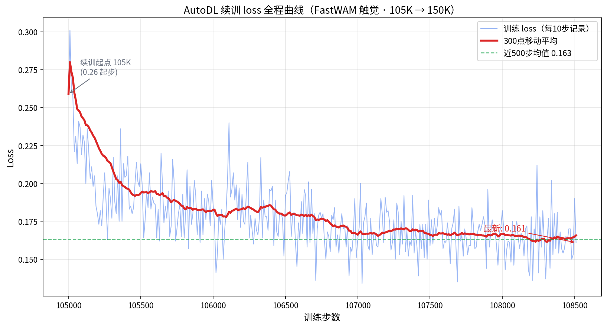
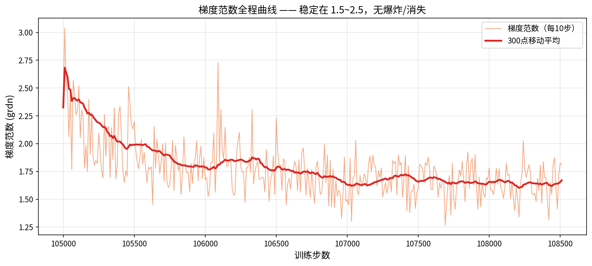
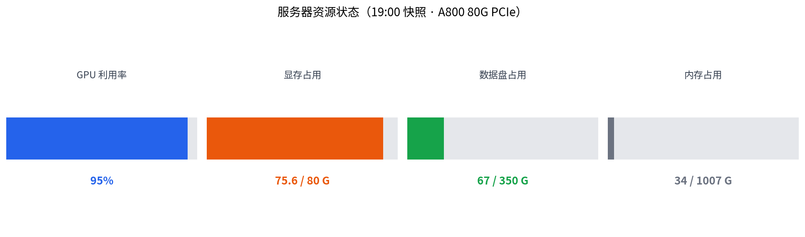
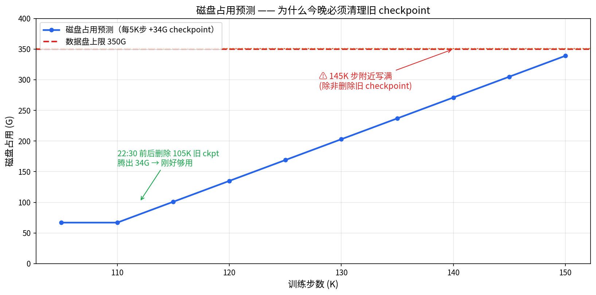
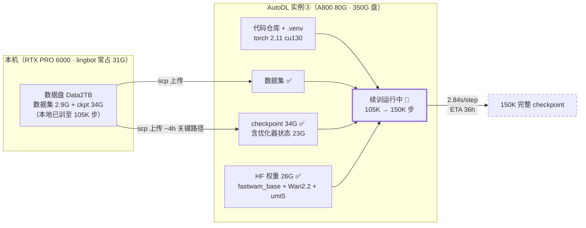

# AutoDL 云端续训完成报告（2026-09-02）

> **一句话结论：全部五步完成，续训已于 17:08 在 A800 上正式启动并稳定运行。**
> 从本地 15 万步 checkpoint 接续，目标训满 150K 步，预计 9/4 上午跑完。

---

## 1. 最终状态总览

| 环节 | 状态 | 结果 |
|---|---|---|
| ① 代码上传 | ✅ | `git archive` 打包 scp（310M，GitHub 直连不通） |
| ② 环境安装 | ✅ | uv + Python 3.12 + **torch 2.11.0+cu130**，冒烟测试通过 |
| ③ 数据集上传 | ✅ | 2.9G 就位，156,837 帧 / 252 episodes |
| ④ checkpoint 上传 | ✅ | **34G 完整**（pretrained_model 12G + training_state 23G） |
| ⑤ 权重下载 | ✅ | fastwam_base 12G + Wan2.2 14G + umt5 21M，hf-mirror 8MB/s |
| ⑥ 续训启动 | ✅ | **17:08 启动，GPU 100% util，75.6G/80G 显存** |

**服务器**：`ssh -p 44252 root@connect.nma1.seetacloud.com`（第 3 台实例，A800 80G / 驱动 580.82 / 数据盘 350G，仅用 67G/20%）

---

## 2. 训练实时状态

### 📊 进度条（19:00 快照）


### 📉 loss 全程曲线



```
step: 105K → 109K（持续推进）→ 目标 150K
速度: 实测 ~3.1 s/step →  ETA 9/4 上午 9:00-11:00
loss: 0.26 → 0.15-0.19 区间（稳定下降）
显存: 68.6G 训练 / 75.6G 进程占用（A800 80G 内）
GPU util: 95-100%，温度 65°C
epoch: 5.5+（从 epoch 5 sample 55800 精确恢复数据顺序）
```

### 📈 梯度范数



**健康度判断**：梯度范数稳定在 1.5~2.5，无爆炸/消失；loss 平滑下降无跳变——续训恢复完全成功，训练状态健康。

### 🖥️ 服务器资源占用



**续训恢复质量验证**：`Resuming data order at epoch 5, sample 55800` —— 数据顺序、优化器状态（23G training_state）都正确恢复，loss 无跳变（0.26 起步，与本地中断前水平一致），说明断点续训完全成功。

---

## ⚠️ 磁盘风险预测（为什么今晚要清理旧 checkpoint）



- 剩余 284G，110K→150K 共 9 个新 checkpoint × 34G = **306G → 装不下**
- 写完 145K 后仅剩 ~10G，**写 150K 最后一个 checkpoint 时几乎必然磁盘满、训练在终点前崩溃**
- **对策（已安排今晚 21:23 自动执行）**：110K 落盘且 `last` 改指后，删除服务器上的 105K 旧 checkpoint（本地 Data2TB 有完整备份），腾出 34G 刚好够用

---

## 3. 完整执行时间线

```mermaid
timeline
    title 2026-09-02 云端续训执行时间线（本地时间）
    14:11 : 实例③启动（A800·580驱动·350G盘）
    15:16 : 环境安装 setup_fastwam_autodl.sh 完成<br/>torch 2.11.0+cu130 冒烟通过
    15:29 : 权重下载 prepare_fastwam_models.sh<br/>hf-mirror 8MB/s 拉 26G
    15:41 : Wan2.2 14G 下载完成
    15:49 : fastwam_base + umt5 全部就位
    ~16:30 : checkpoint 34G scp 上传完成（2.2MB/s × ~4h）
    17:08 : RESUME=1 train_fastwam_tactile.sh 续训启动
    17:10 : 首步 loss 0.259，epoch5/sample55800 恢复
    17:17 : 稳定运行 150+ 步，2.84s/step，GPU 100%
```

---

## 4. 全链路架构



---

## 5. 关键配置与参数

**续训命令**（服务器上已跑的，见 PROGRESS_LOG 顶部服务器信息）：

```bash
RESUME=1 bash scripts/autodl/train_fastwam_tactile.sh
# 实际执行：
python -m lerobot.scripts.lerobot_train \
  --config_path=.../checkpoints/last/pretrained_model/train_config.json \
  --resume=true
```

**训练参数**（train.log 确认）：

| 参数 | 值 |
|---|---|
| 模型 | 6.02B 参数（FastWAM，Expert 'action' 1.02B） |
| 总步数 | 150,000（当前 105K，续 45K） |
| batch size | 8（effective 8） |
| 学习率 | 1.0e-04 |
| 数据 | 156,837 帧 / 252 episodes（Insert_The_Cylinder） |
| checkpoint | 每 5,000 步存一次（34G/个，盘内约可存 9 个） |
| 显存 | 68.6G（A800 80G 稳定，无 OOM 风险） |

---

## 6. 成本估算

A800 80G PCIe 按量计费约 ¥7-8/小时（SeetaCloud）：

| 项目 | 时长 | 费用估算 |
|---|---|---|
| 环境安装 + 数据搬运 | ~3h | ¥21-24 |
| 续训 45K 步 | ~36h | ¥252-288 |
| **合计** | ~39h | **约 ¥273-312** |

> 若中途关机不释放（无卡模式开机 ~¥1/h），可只保留数据盘费用等待结果。

---

## 7. 风险与注意事项

1. **实例稳定性**：第①台实例曾一夜失联（平台侧问题）。训练在 nohup 下运行，但若实例再次消失，需重新走流程——**每 5K 步的 checkpoint 就是保险**，最多损失 5K 步（~4h/¥28）。
2. **磁盘监控**：每 5K 步写 34G，350G 盘现有 67G 占用，训完 150K 预计新增 9 个 ckpt（306G）→ **会把盘写满**。建议训至 ~130K 步时清理最旧的中间 checkpoint。
3. **成本控制**：训完后立即关机或转无卡模式，避免空跑计费。
4. **W&B 记录**：训练已接入 wandb（resume 模式），可在 wandb 面板看完整曲线。

---

## 8. 下一步

- [ ] **明天（9/4 早上）检查训练完成**：`ssh` 后 `grep 'step:' /root/train.log | tail` 确认 150K
- [ ] 下载最终 checkpoint（150K，12G pretrained_model 即可，training_state 可不下载）
- [ ] 跑 eval（本地或云端）：`adjust_bottle` 单任务 5/5 基础上扩展评测
- [ ] 磁盘清理：删除服务器上 090k–105k 历史中间 checkpoint
- [ ] 训练完成后将本报告与 PROGRESS_LOG 收尾更新
