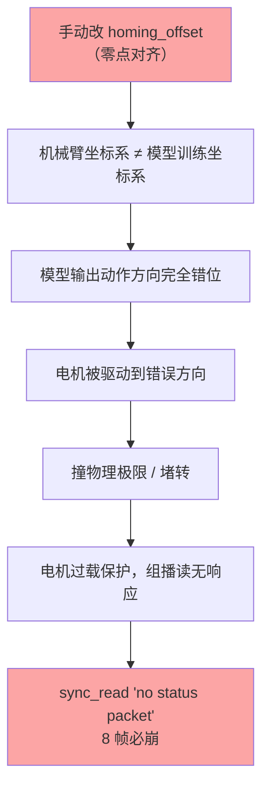

# 错误总结：机械臂 rollout 8 帧崩溃 —— 校准零点被手动改坏

> 日期：2026-09-04　|　状态：**已解决 ✅**
> 一句话：圆柱插入 rollout 每次跑 8-10 帧就 `sync_read` 丢包崩溃，根因是我下午做「零点对齐」时手动改了 `homing_offset`，破坏了模型训练时的坐标系，导致电机被驱动到错误方向撞极限堵转过载。

---

## 1. 现象

`lerobot-rollout` 圆柱插入任务（ACT 触觉模型）反复崩溃，模式高度一致：

| 尝试 | 相机设置 | 结果 |
|---|---|---|
| 第 1 次 | 640×360@30 | 跑 10 帧崩 |
| 第 2 次 | 640×360@30 | 跑 8 帧崩 |
| 第 3 次 | 640×360@15 | 跑 8 帧崩 |
| 第 4 次 | 320×180@10 | 相机不支持，configure 失败 |

崩溃点统一：`sync_read('Present_Position')` 组播读报 `ConnectionError: no status packet`（重试 3 次失败）。

## 2. 根因

**手动改坏了校准文件的 `homing_offset`。**

时间线：当天 14:xx 用户反馈「主臂某轴和从臂不对」，我做了一次「零点对齐」——把两臂校准的 `homing_offset` 直接改成"当前 raw 位置"，意图让两臂零点一致。但这破坏了**模型训练时（7/24）的坐标系**。

正确校准 vs 被我改坏的值（homing_offset，计数）：

| 关节 | 正确（7/24 训练时） | 改坏（今天） | 偏差 |
|---|---|---|---|
| shoulder_pan | -1869 | -2034 | -165 |
| shoulder_lift | **-914** | **2043** | **+2957** |
| elbow_flex | **-1934** | **157** | **+2091** |
| wrist_flex | **-1940** | **292** | **+2232** |
| wrist_roll | -1748 | 1880 | +3628 |
| gripper | **1038** | **-1724** | **-2762** |

## 3. 因果链



**最有力的证据**（崩溃前抓取的 8 帧 episode，模型目标 vs 机械臂实际）：

| 关节 | 模型要的位置 | 实际到达 | 偏差 |
|---|---|---|---|
| elbow_flex | +77.8° | -12.8° | **90°（方向反）** |
| wrist_flex | +36° | -129.8° | **165°** |
| shoulder_lift | -76° | -38.8° | 37° |

机械臂在往模型要求的反方向跑，必然撞限位。

## 4. 排查过程（排除法）

| 假设 | 测试 | 结论 |
|---|---|---|
| 相机抢 USB 带宽 | 降到 320×180@10 仍崩 | ❌ 排除 |
| 触觉串口干扰 | 触觉并发 + 电机读 200 次全成功 | ❌ 排除 |
| 电机总线本身坏 | 静止时连续读 100 次全成功 | ❌ 排除 |
| **模型动作与机械臂错位** | 读 episode 的 action vs state | ✅ **命中** |

关键盲点：手动测试时电机**静止**（disable torque），没堵转所以读正常，掩盖了真凶。只有 rollout 里电机**运动**时才暴露。

## 5. 解决

从项目路径恢复 7/24 训练时的正确校准：

```bash
cp /media/mosense/Data2TB/Projects/Mosense-LeRobot/configs/lerobot/calibration/robots/so_follower/mosense_follower_arm.json \
   ~/.cache/huggingface/lerobot/calibration/robots/so_follower/mosense_follower_arm.json
```

恢复后重跑，**完整跑通**：1021 帧 / ~34 秒，全程无中断，用户确认「这次是对的」。

## 6. 教训（三条）

1. **绝不要手动改 `homing_offset` 做「零点对齐」**。零点对齐必须走 `lerobot-calibrate` 重新校准，因为它会同步更新电机里的值 + 保持坐标系一致性。
2. **正确校准文件的权威位置**在项目路径 `/media/mosense/Data2TB/Projects/Mosense-LeRobot/configs/lerobot/calibration/`（7/24 训练时版本），`~/.cache` 只是缓存副本，会被覆盖/改坏。
3. **排查通信故障时，要让电机处于运动状态**（enable torque + 驱动），静止态测不出堵转过载类问题。

## 7. 关联

- [TROUBLESHOOT_RECORD_EXIT.md](TROUBLESHOOT_RECORD_EXIT.md) —— 层③（sync_read 失败）已定位为此根因；层①②（录制校准提示/键盘监听）仍待解决
- 云端 FastWAM 150K 训练（圆柱插入正主任务）——模型训练用的正是这套 7/24 校准坐标系
