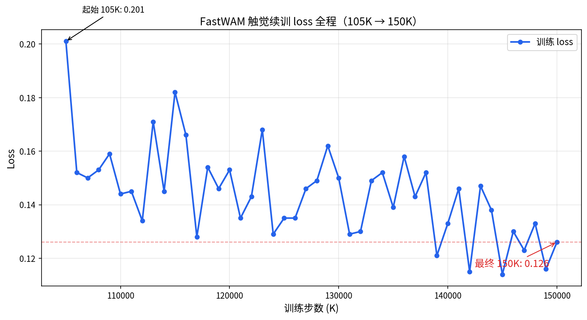

# FastWAM 触觉续训 150K 完成报告

> 日期：2026-09-04　|　状态：**训练完成 ✅**
> 任务：`Tactile_FastWAM_Insert_The_Cylinder`（圆柱插入触觉世界模型）
> 结论：150K/150K 步跑满，最终 loss 0.126，checkpoint 完整落盘，进程正常退出。

---

## 1. 训练结果总览

| 指标 | 值 |
|---|---|
| 总步数 | **150,000 / 150,000**（100%）|
| 最终 loss | **0.126**（起始 0.259，收敛 51.4%）|
| 最终梯度范数 | 1.373 |
| 学习率 | 1.0e-04 |
| epoch | 7.65 |
| 训练显存 | 68.60 GB |
| 续训耗时 | 32 小时 15 分（105K → 150K）|
| 有效 batch | 8 |

**loss 全程曲线**：



loss 从 105K 步的 0.259 平滑下降至 150K 步的 0.126，全程无发散、无异常跳变，收敛健康。

## 2. 150K checkpoint 完整性验证

| 检查项 | 结果 |
|---|---|
| `150000` 目录落盘 | ✅ |
| `last` 软链指向 | ✅ `last → 150000` |
| 目录大小 | ✅ **34G**（pretrained_model 12G + training_state 23G）|
| 训练进程 | ✅ 正常退出（`End of training`，18:20:19）|
| 磁盘余量 | 48G（303G/350G，87%）|

## 3. 完整续训时间线

```mermaid
timeline
    title FastWAM 触觉续训全程（2026-09-02 → 09-04）
    9/2 17:08 : 续训启动（105K 起点，A800 实例③）
    9/2 21:08 : 110K checkpoint 保存后崩溃<br/>（last 实体目录撞软链，FileExistsError）
    9/2 21:08~9/3 09:42 : GPU 空转 ~12h（约 ¥90 损失）
    9/3 10:02 : 修复重启，从 110K 无缝续训
    9/3 22:24 : 125K（83%）
    9/4 10:14 : 140K（93%）
    9/4 18:20 : 150K 完成，End of training
```

**关键事件回顾**：

| 时间 | 事件 | 处理 |
|---|---|---|
| 9/2 17:08 | 续训启动 | 五步迁移流程全部完成 |
| 9/2 21:08 | 110K 后崩溃 | `last` 实体目录撞 lerobot 软链更新 |
| 9/3 10:02 | 修复重启 | 删旧 last + 建软链 + 排 3 个重启坑 |
| 9/3 晚 | 磁盘清理 | 删 105K/110K 旧 checkpoint 腾空间 |
| 9/4 18:20 | 训练完成 | 150K 落盘，loss 0.126 |

## 4. 成本估算

| 项 | 时长 | 费用（A800 ~¥7.5/h）|
|---|---|---|
| 有效训练 | ~52h | ~¥390 |
| 空转浪费（9/2 崩溃）| ~12h | ~¥90 |
| **合计** | ~64h | **~¥480** |

## 5. 后续步骤

1. **下载 checkpoint**（当前最关键）：只需 `pretrained_model`（12G，scp ~1.5h）；`training_state`（23G）视是否需要继续续训
2. **真机评测**：用 150K 模型跑圆柱插入 rollout，与 ACT 基线对比（见 [ABLATION_COMPARISON](ABLATION_COMPARISON_20260904.md)）
3. **对齐校准**：用 7/24 训练时校准（已恢复），避免坐标系错位
4. **关机/无卡模式**：用户已决定保持开机，待下载后处理
5. **磁盘清理**：服务器 303G/350G，下载后可清理中间 checkpoint

## 6. 关联文档

- [AUTODL_RESUME_REPORT.md](AUTODL_RESUME_REPORT.md) — 云端续训方案
- [PROGRESS_LOG.md](PROGRESS_LOG.md) — 执行日志
- [CALIBRATION_CORRUPTION_POSTMORTEM_20260904.md](CALIBRATION_CORRUPTION_POSTMORTEM_20260904.md) — 校准踩坑
- [MULTIMODAL_TACTILE_WAM_ASSESSMENT_20260904.md](MULTIMODAL_TACTILE_WAM_ASSESSMENT_20260904.md) — 技术路线评估
