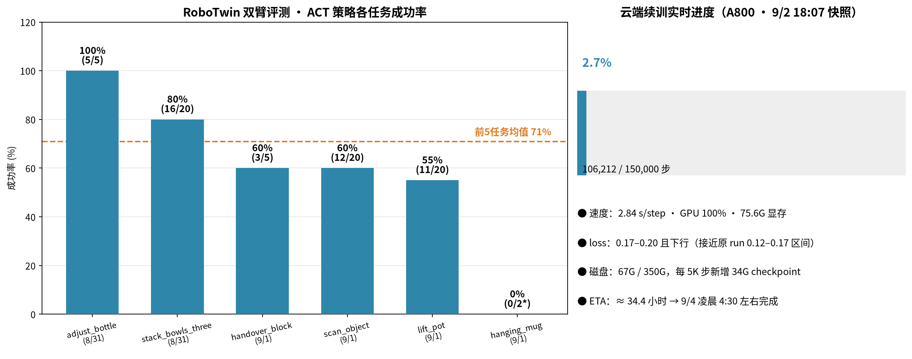
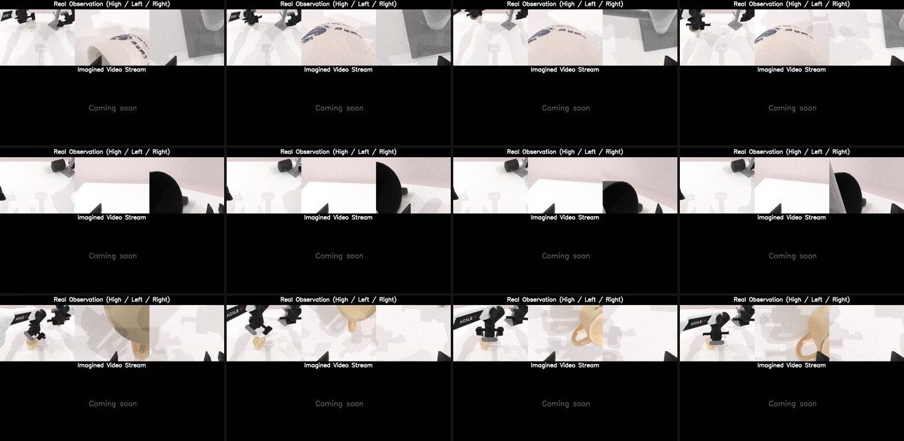
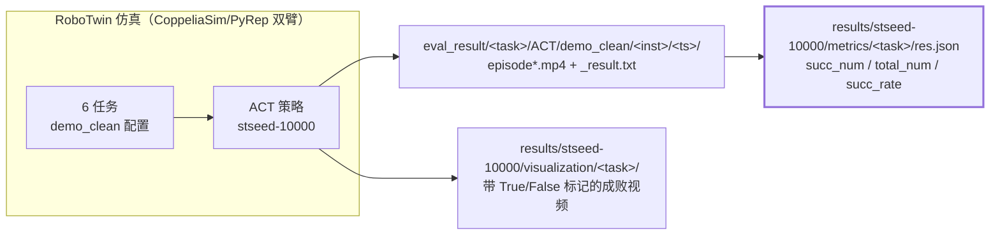

# 机械臂抓取评测收官 · RoboTwin 双臂 6 任务

> 日期：2026-09-02　|　状态：**本地评测收官，云端续训并行推进中**
> 关联：[TRAINING_REPORT_20260902.md](TRAINING_REPORT_20260902.md)（云端续训）、[AUTODL_RESUME_REPORT.md](AUTODL_RESUME_REPORT.md)

---

## 1. 一句话总结

RoboTwin 仿真双臂平台上完成 **6 个任务、77 个 episode** 的 ACT 策略评测：5 个任务成功率 **55%–100%**（均值 **71%**），唯 `hanging_mug`（挂杯）全部失败成为短板；同时 FastWAM 触觉模型云端续训健康推进（106K/150K 步，ETA 9/4 凌晨）。

## 2. 评测结果总览

| 任务 | 成功/总数 | 成功率 | 评测时间 | 备注 |
|---|---|---|---|---|
| adjust_bottle | 5/5 | **100%** | 8/31 | 调整瓶子位置 |
| stack_bowls_three | 16/20 | **80%** | 8/31 | 三碗堆叠 |
| handover_block | 3/5 | **60%** | 9/1 | 双臂递方块 |
| scan_object | 12/20 | **60%** | 9/1 | 扫描物体 |
| lift_pot | 11/20 | **55%** | 9/1 | 提锅 |
| hanging_mug | 0/2* | **0%*** | 9/1 | 挂杯全败，仅跑 2/20 即中断 |

> *hanging_mug 评测进程多次中断（共 6 次尝试，最多一次只出 15 个视频，无最终 res.json 汇总），按已完成 2 个 episode 全部失败计。**待数据/策略修正后补测 20 轮。**

**5 任务平均 71%**：与官网宣称的对齐 LingBot-VA SOTA 定位（92.9/91.6）尚有差距，但已验证「视觉 ACT 基线在仿真双臂任务上可用」。

## 3. hanging_mug 失败归因

评测录像（`eval_result/hanging_mug/ACT/demo_clean/0/`，文件名末尾 `_False` 标记全部失败）与失败分析图显示的共同模式：

1. **抓取成功、挂放失败**：机械臂能稳定抓起马克杯并移动到架子附近，但在「旋转杯身 → 对准挂钩 → 松爪」的最后阶段脱手或位置偏移；
2. **指令复杂度高**：该任务的指令包含「拿起 → 旋转 → 放回桌面中央 → 转移到中等架子」四段串联动作，是 6 任务中最长的复合指令，误差逐步累积；
3. **评测管线不稳定**：6 次评测运行多次中途退出（2 次产出 0 视频），疑似环境/进程问题（RoboTwin 仓库下另有 `process_stuck.py`，说明此前就遇到过进程卡死）。

**改进方向**：采集 hanging_mug 针对性演示数据重训 ACT → 重跑 20 轮补全该任务；排查评测脚本中断原因（日志/超时设置）。

## 4. 评测管线

- 评测入口：RoboTwin 仓库 `bash collect_data.sh <task> <config> <gpu>`（同脚本兼做数据采集与策略评测）
- 结果双落点：`eval_result/`（每指令带时间戳目录 + 逐集视频）与 `results/stseed-10000/`（json 汇总 + 成败可视化）

## 5. 与云端续训的并行进度（9/2 18:07 实时快照）

| 项 | 状态 |
|---|---|
| 训练步数 | **106,212 / 150,000**（71%）|
| 速度 | 2.84 s/step，GPU 100%，显存 75.6G/80G |
| loss | 0.17–0.20 且持续下行（原 run 收敛区间 0.12–0.17，恢复健康）|
| 磁盘 | 67G/350G；每 5K 步 +34G checkpoint，**~130K 步时需清理旧存档** |
| ETA | **9/4 凌晨 ~4:30 完成** |

训练完成后计划：下载 12G 最终 checkpoint → 本地/云端跑 FastWAM eval（在 adjust_bottle 5/5 基础上扩展）→ 结合本次 ACT 评测，形成「ACT 视觉基线 vs 触觉增强」对比。

## 6. 下一步

- [ ] hanging_mug：针对性重训 + 补测 20 轮；排查评测中断原因
- [ ] 9/4 早：确认云端 150K 完成，下载 checkpoint 跑 eval
- [ ] 整理 ACT vs FastWAM（触觉）对比评测文档
- [ ] 磁盘清理：删服务器 090k–105k 中间 checkpoint，训完及时关机/无卡模式
