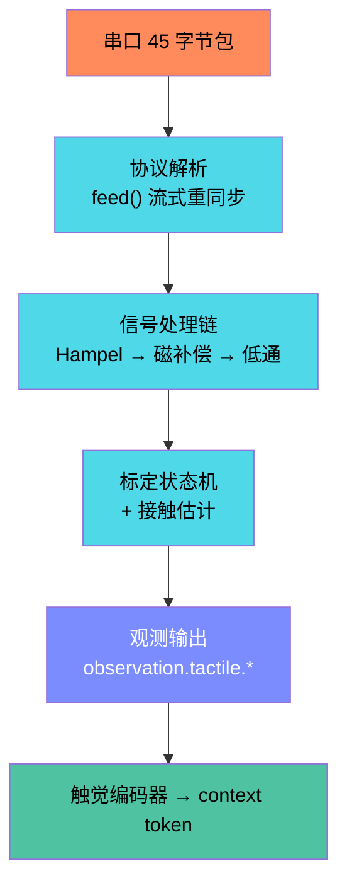
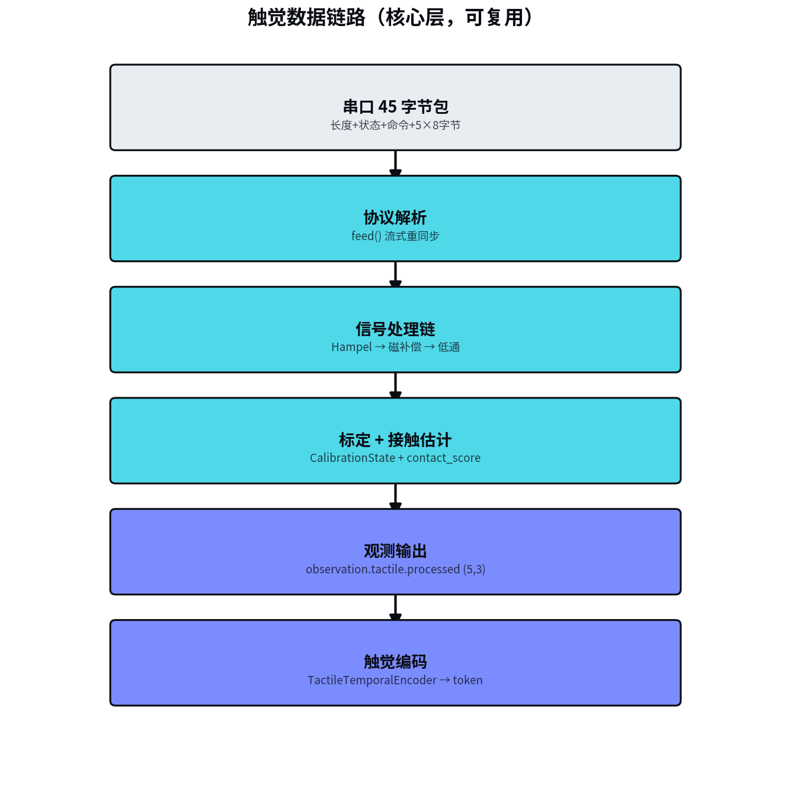
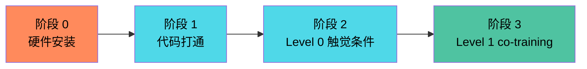
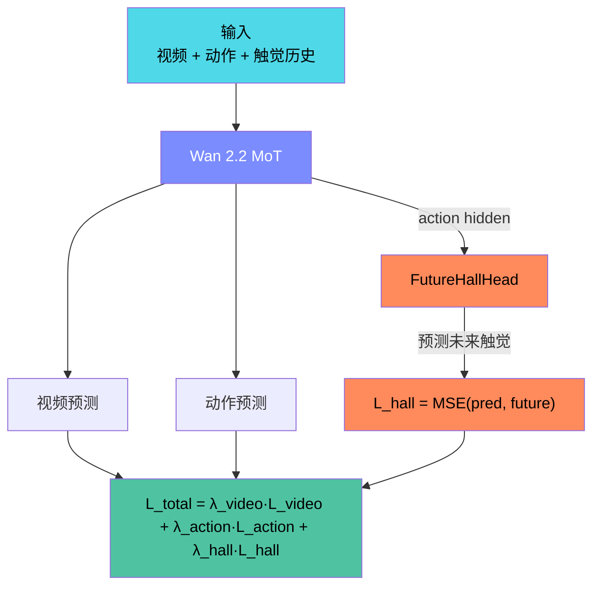
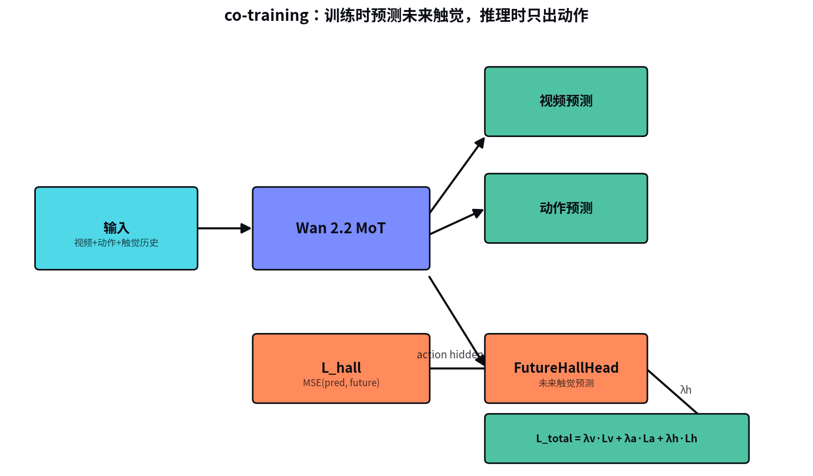

# LingBot-VA × Tactile 整合方案

> 目标：把 MoSense 霍尔触觉传感器接进 LingBot-VA 的世界模型，实现「触觉条件的世界模型」。
> 关联仓库：
> - LingBot-VA（视觉世界模型，Wan 2.2 基座，RoboTwin SOTA）
> - [MoSenseHK/Multimodal-Tactile-Sensing-for-Embodied-AI](https://github.com/MoSenseHK/Multimodal-Tactile-Sensing-for-Embodied-AI)（触觉数据链路 + FastWAM co-training）

---

## 1. 两个项目的定位

| | LingBot-VA | Tactile（FastWAM fork）|
|---|---|---|
| 基座 | Wan 2.2 transformer | FastWAM |
| 能力 | 视频-动作联合预测，RoboTwin 92.9% SOTA | 触觉数据链路 + 触觉 co-training |
| 输入 | 多路相机 + 文本 | 视觉 + 霍尔触觉历史 |
| 触觉 | 无 | 完整（协议→信号处理→观测→FutureHallHead）|
| 训练 | FSDP 8 卡，torch 2.9 | LeRobot 单机 |

核心判断：LingBot-VA 有更强的「想象（世界模型）」，Tactile 项目有 MoSense 缺的「感受（触觉）」。整合 = 把触觉接进 LingBot-VA 的世界模型。

---

## 2. 关键约束（现状）

1. **传感器尚未安装到 SO-ARM101 夹爪**（机械结构由同事设计中，串口/采样率/安装状态未验证）—— 硬件是当前真正的瓶颈。
2. **FastWAM 触觉训练代码已迁移**到兄弟项目 `Mosense-LeRobot-Tactile`，当前项目 `third_party/lerobot/` 保持非触觉状态。
3. **触觉核心代码仍在**当前项目 `src/mosense_lerobot/tactile/`，可复用。

---

## 3. 整合架构

```mermaid
flowchart LR
    A["SO-101 夹爪<br/>霍尔传感器（待装）"] -->|"串口 45 字节包"| B["① 协议解析<br/>MosenseHallStreamDecoder"]
    B --> C["② 信号处理<br/>EFleshProcessor"]
    C --> D["③ 触觉 token 编码<br/>TactileTemporalEncoder"]
    D -->|"context token"| E["④ LingBot-VA<br/>Wan 2.2 世界模型"]
    E -->|"视频-动作预测"| F["⑤ FutureHallHead<br/>未来触觉预测"]
    F -->|"λ_hall co-training"| G["接触辨识 / 空抓判断"]

    style A fill:#ff8a5c,color:#000
    style B fill:#4fd8e8,color:#000
    style C fill:#4fd8e8,color:#000
    style D fill:#4fd8e8,color:#000
    style E fill:#7b8cff,color:#fff
    style F fill:#7b8cff,color:#fff
    style G fill:#4fc3a1,color:#000
```

前 ③ 步几乎零改动（现成独立模块），真正要写的只有 ④⑤。

---

## 4. 触觉数据链路（复用部分）

---

## 5. 可复用清单

**核心层（纯 numpy，零 LeRobot 依赖，直接复用）**

| 模块 | 作用 |
|---|---|
| `adapters/mosense_hall.py` | 45 字节串口协议解析 |
| `processing.py` | 简单三段式信号处理 |
| `eflesh_processing.py` | 富处理链（Hampel→磁补偿→低通→死区→接触）|
| `calibration.py` | 标定状态机 |
| `schema.py` | 数据结构 |

**接入层（LeRobot 特定，需适配）**

| 模块 | 复用情况 |
|---|---|
| `lerobot_integration.py` | 需重写成 LingBot-VA 的注入方式 |
| `sensors/mosense_hall.py` | 需重写 |

落地方式：copy 进 `lingbot-va/`，或打包成独立小库 `mosense-tactile`（pip 安装，两项目共用）。

---

## 6. 分阶段实施

| 阶段 | 内容 | 前置 |
|---|---|---|
| 0. 硬件 | 传感器装夹爪 + 串口/采样率/安装验证 | 机械设计完成 |
| 1. 代码打通 | 核心模块接入 lingbot-va，跑通「串口→触觉 token」| 阶段 0 |
| 2. 模型改造（Level 0）| 触觉 token 拼进 Wan 输入，先不加未来 head | 阶段 1 |
| 3. co-training（Level 1）| 加 FutureHallHead + λ_hall，真机数据验证 | 阶段 2 + 数据 |

阶段 0 是卡点；阶段 1-3 可提前并行做代码准备。

---

## 7. 模型 co-training 结构（移植到 LingBot-VA）

关键：**未来触觉 loss 只在训练时起作用**，推理时只出动作——逼 MoT hidden 内化「动作→接触变化」的因果。

---

## 8. 关键技术难点

1. **时序对齐**：相机抽帧（5-15fps）vs 触觉高频串口流，需对齐时间戳。参考 `tactile_delta_indices` 独立窗口方案。
2. **基座冻结策略**：先 `freeze_video_expert` + 只训触觉 encoder/head，避免扰动 Wan 2.2 视觉主干（对应 Level 0/1 渐进）。
3. **触觉任务选择**：RoboTwin 仿真无触觉，真正 co-training 需在真机数据上做（视觉遮挡/空抓判断）。

---

## 9. 提醒

- 整合 LingBot-VA 要复用 FastWAM 的**思路**（FutureHallHead co-training 设计），不是搬回代码——LingBot-VA 基座更强，要的是触觉的「接入模式」。
- 硬件安装进度是当前真正的卡点，建议先与机械同事确认传感器安装时间表。
