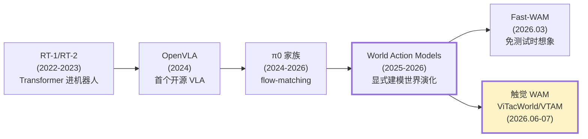
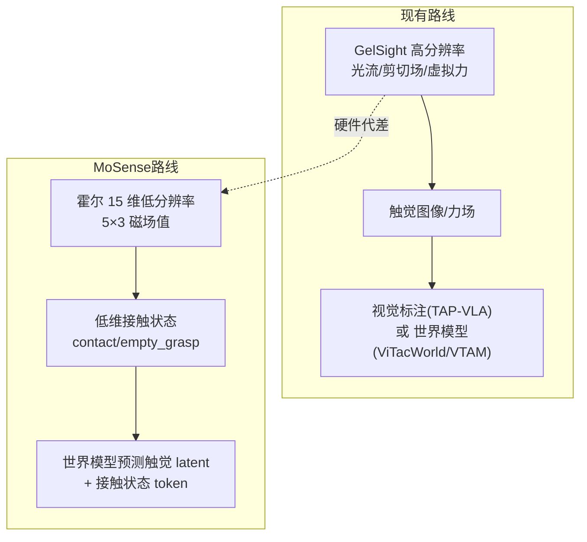
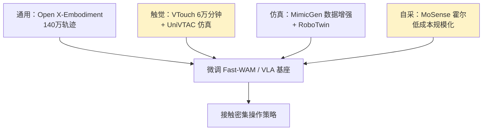

# 多模态触觉世界模型技术评估报告

**Tactile × Video × Action × Language × Speech 技术路线领先性评估**

> 评估日期：2026-09-04
> 评估对象：MoSense「触觉 × 世界模型」机器人多模态模型路线
> 评估方法：对 2026 年最新世界动作模型（WAM）与视觉-触觉-动作模型（VTA）代表性工作的系统性对标分析
> 参考来源：项目 `docs/paper/` 5 篇论文 + awesome-vla-2026 全景（250+ 篇）+ 3 篇在线解读

---

## 目录

1. [摘要](#一摘要)
2. [结论速览（抽取）](#二结论速览抽取)
3. [项目目标与技术定位](#三项目目标与技术定位)
4. [技术版图全景：VLA 与 WAM 的 2026](#四技术版图全景)
5. [核心论文深度解读](#五核心论文深度解读)
6. [与项目目标的对照分析](#六与项目目标的对照分析)
7. [领先性评估（SWOT）](#七领先性评估swot)
8. [硬件短板深度分析](#八硬件短板深度分析)
9. [差异化路径建议](#九差异化路径建议)
10. [最终结论](#十最终结论)
11. [算法壁垒与算力门槛](#十一算法壁垒与算力门槛)
12. [数据来源盘点（战略核心）](#十二数据来源盘点战略核心)
13. [训练技巧清单（先学习后深究）](#十三训练技巧清单先学习后深究)
14. [参考文献](#十四参考文献)

---

## 一、摘要

MoSense 项目的最终目标是构建一个融合 **触觉（Tactile）、视频（Video）、动作（Action）、语言（Language）、语音（Speech）** 五模态的机器人控制模型，底层基于 LingBot-VA 的复现与 Fast-WAM 触觉扩展。本报告通过系统对标 2026 年 3—7 月间发布的核心工作，评估该路线的技术领先性与竞争格局。

**核心判断**：该路线在「方向选择」与「时间窗口」上处于正确位置——世界动作模型（WAM）刚刚被验证为视觉-语言-动作模型（VLA）的下一代范式，视觉-触觉世界模型则是 2026 年 7 月才密集涌现的最前沿方向。但在「硬件能力」与「原创性」两个维度上存在显著短板：项目所用的 Mosense 传感器为 15 维低分辨率霍尔阵列，与前沿工作普遍采用的 GelSight 高分辨率视觉触觉存在**硬件代差**；触觉×世界模型的赛道已被上科大 ViTacWorld、上交 VTAM 等占据，项目属于**追赶者与扩展者**而非开创者。

**真正的胜负手**在于：能否为「低维、低成本、可量产的霍尔触觉」找到一条 GelSight 高分辨率路线走不通的差异化整合路径。

---

## 二、结论速览（抽取）

> 以下是本报告抽取的核心结论，每一条在正文中有对应的数据与论文依据。

### 结论 1：世界模型路线正确，是 VLA 的下一代
Fast-WAM（清华 × Galaxea AI，2026.03）证明：世界动作模型**不需要测试时显式预测未来视频**，视频建模的价值主要在训练期学习物理先验。它在 LIBERO 达 **97.6%**、RoboTwin 达 **91.8%** 成功率，推理延迟仅 **190ms**（比想象-再-执行范式快 4× 以上）。项目选择复现 Fast-WAM，路线方向正确。

### 结论 2：触觉 × 世界模型是 2026 年最前沿，但已非空白
ViTacWorld（上科大，2026.07）、VTAM（上交 × UIUC，2026.06）等证明「触觉作为锚定信号进入预测性世界模型」能显著提升接触密集型任务成功率（VTAM 在薯片抓取 90%、黄瓜削皮 85%、白板擦拭 95%）。项目踩在正确的时间点，但**不是首创者**。

### 结论 3：最大短板是触觉硬件分辨率
前沿工作（ViTacWorld、VTAM、TAP-VLA）普遍使用 **GelSight 高分辨率视觉触觉传感器**，能计算光流、剪切场、虚拟力。而 MoSense 是 **5 路三轴霍尔 = 15 维**低分辨率磁场值，**无法支持** VTAM 的虚拟力正则化、TAP-VLA 的剪切场投影等关键技术。这是硬件代差，不是软件能弥补的。

### 结论 4：触觉整合方式比触觉本身更重要
TAP-VLA（密歇根，2026）的关键实验发现：加触觉编码器反而 **32% < 纯视觉 43% < 视觉标注 78%**。意味着低维触觉若以「加编码器硬塞进 VLA」的朴素方式整合，极可能重蹈 32% 的覆辙。整合方式必须系统性消融。

### 结论 5：五模态齐全（含语音）是真实差异化
awesome-vla-2026 全景显示，语音/音频进 VLA 的工作极少（VLAS、Shake-VLA 等），多传感器融合（OmniVLA、FuSe）也未覆盖「触觉+视频+动作+语言+语音」的完整组合。项目在模态齐全度上领先。

### 结论 6：综合定位 = 方向领先、时机正确、硬件短板致命、非首创
项目是「世界模型 × 触觉」浪潮中的**早期参与者**，但拼硬件分辨率拼不过 GelSight 路线，胜负手在于低维霍尔触觉的独特整合路径。

---

## 三、项目目标与技术定位

### 3.1 最终目标

```
触觉 Tactile  ─┐
视频 Video    ─┤
动作 Action   ─┼──► 统一多模态模型 ──► 机器人接触密集操作
语言 Language ─┤
语音 Speech   ─┘
```

### 3.2 底层技术栈

| 层 | 内容 | 状态 |
|---|---|---|
| 模型 | Fast-WAM（复现）+ 触觉扩展 | 云端 150K 已训完（loss 0.126）|
| 触觉 | MoSense 5 路三轴霍尔（15 维）| 真机数据流正常 |
| 语音 | 本地 Whisper 识别 + TTS | 已跑通 |
| 硬件 | SO-101 双臂 + 双相机 | 校准联调完成 |

### 3.3 定位判断

项目本质是「**在清华 Fast-WAM 的世界模型框架上，加入自研低维触觉作为额外 observation，并扩展语音模态**」。这决定了它的创新性质是**增量式扩展**，而非架构级原创。

---

## 四、技术版图全景：VLA 与 WAM 的 2026

### 4.1 VLA 基础范式演进



### 4.2 awesome-vla-2026 的 15 大技术维度

| 维度 | 代表工作 | 与项目相关性 |
|---|---|---|
| 基础范式 | RT-2, OpenVLA, π0 | ★ 背景 |
| Generalist VLA | CogACT, SmolVLA, RDT2 | ★ 竞争基线 |
| 架构（AR/Diffusion/Flow/Dual/MoE/Mamba）| π0.7, HiRT, CogACT | ★★★ 选型参考 |
| 输入模态·3D/4D | SpatialVLA, PointVLA | ★ 相机选型 |
| **输入模态·触觉/力** | **Tactile-VLA, ForceVLA, VLA-Touch** | ★★★★★ 直接对标 |
| **输入模态·语音** | **VLAS, Shake-VLA** | ★★★★ 差异化点 |
| 多传感器融合 | OmniVLA, FuSe, OmniVTLA | ★★★★ 直接对标 |
| 动作表征 | FAST, LAPA, GR00T N1 | ★★ 触觉动作 token |
| 推理 ECoT | ECoT, CoT-VLA, ThinkAct | ★ 可选增强 |
| Efficient VLA | TinyVLA, BitVLA, VLA-Cache | ★★ 落地效率 |
| RL 微调 | VLA-RL, SimpleVLA-RL | ★★ 后训练 |
| 数据/预训练 | Open X-Embodiment, DROID | ★★★ 数据来源 |
| 跨本体 | X-VLA, UniVLA | ★ 泛化 |
| 灵巧手 | DexVLA, GR-RL | ★ 下游 |
| 记忆/长程 | MemoryVLA, MemER | ★ 长程任务 |

### 4.3 ICLR 2026 九大趋势

1. 离散扩散（Discrete diffusion）
2. 具身思维链推理（ECoT）
3. 新动作 tokenizer
4. 效率优化
5. RL 微调
6. **视频预测（Video prediction）** ← 与 WAM 路线共振
7. Benchmark 革新
8. 跨本体迁移
9. 记忆与组合

**关键观察**：视频预测（WAM 的核心）是 ICLR 2026 的九大趋势之一，且触觉/力模态是输入模态扩展的活跃分支。项目方向与学术界大势共振。

---

## 五、核心论文深度解读

### 5.1 Fast-WAM（清华 × Galaxea AI，arXiv:2603.16666，2026.03）

**一句话**：世界动作模型不需要测试时「想象未来」，视频建模的价值在训练期。

**核心问题**：现有 WAM 走「想象-再-执行」（imagine-then-execute）范式，测试时迭代视频去噪带来巨大延迟；但没人验证「显式未来想象」是否真的必要。

**方法**：提出 Fast-WAM，训练时保留视频 co-training（学物理先验），测试时跳过未来预测。并实例化多个变体做受控消融：
- Fast-WAM-Joint（联合建模）
- Fast-WAM-IDM（逆动力学）
- 去除视频 co-training 的对照

**实验结果**：

| 基准 | Fast-WAM | 对比 |
|---|---|---|
| RoboTwin | **91.8%** | 超 Motus(无预训练 87.8%/有 77.3%)、LingBot-VA(无预训练 80.6%)，接近 LingBot-VA(预训练 92.2%) |
| LIBERO | **97.6%** | 超 π0.5，接近 LingBot-VA 98.5%、Motus 97.7% |
| 延迟 | **190ms** | RTX 5090D，比想象-再-执行快 4× 以上 |

**关键消融**：去除视频 co-training 导致性能大幅下降，而测试时跳过未来预测几乎不影响性能。**结论：视频预测的主要价值在训练期的世界表征，而非测试期生成未来观测。**

**对项目的意义**：这是项目复现的底座，路线已验证。项目的「触觉扩展」正是往 Fast-WAM 的 cross-attention context 里加入触觉时序（design 文档 §3.3 已规划）。

### 5.2 HarmoWAM（北大，arXiv:2605.10942，2026.05）

**一句话**：调和「想象-再-执行」与「联合建模」两种 WAM 范式的 trade-off。

**核心发现**：两种范式有根本 trade-off——想象-再-执行显式利用世界模型，泛化好但交互精度差；联合建模动作精细但受训练分布探索空间约束。

**方法**：HarmoWAM 端到端自适应融合两种范式。

**对项目的意义**：说明 WAM 范式内部仍在快速演进。项目当前复现的是 Fast-WAM 的「联合建模」路线，需关注 HarmoWAM 的自适应思路是否值得吸收。

### 5.3 ViTacWorld（上科大，arXiv:2607.22530，2026.07）—— **最直接对标**

**一句话**：动作条件化的视觉-触觉世界模型，首个用世界模型做 visuo-tactile-action 轨迹生成与策略评估。

**核心问题**：接触丰富任务中触觉是关键模态（非补充信号），但真实触觉数据采集昂贵、硬件依赖、任务多样性差。

**方法**：
1. 利用公开真实触觉数据 + 仿真环境（TacSL/TacEx/UniVTAC）扩展 visuo-tactile-action 数据
2. 关键洞察：触觉信号直接植根于物理接触，**sim-to-real gap 比纯视觉小**
3. 先大规模预训练真实+仿真轨迹，再用真机 rollout 微调
4. 给定动作，预测时序对齐的视觉观测 + 触觉反馈

**双重角色**：
- **合成 rollout** → 数据增强 → 改进下游触觉策略
- **策略评估** → 在受控动作序列下预测动作条件化的视觉-触觉结果

**对项目的意义**：**这是与项目路线几乎重合的工作**（视觉-触觉世界模型 + 动作条件化）。但它用的是 GelSight 类高分辨率触觉，且强调「仿真数据 + 世界模型预测触觉」的规模化路径——这是项目可以借鉴、但硬件上暂时跟不上的地方。

### 5.4 VTAM（上交 × UIUC，arXiv:2603.23481，2026.06）

**一句话**：Video-Tactile-Action Model，触觉作为锚定信号进预测性世界模型，超越 VLA。

**核心问题**：VAM 在长周期视觉任务优秀，但接触丰富场景中关键交互状态仅凭视觉部分可观测（夹持器遮挡、微小形变/滑动不可见）。

**方法三大贡献**：
1. **预测性触觉整合**：把触觉作为互补锚定信号进预测性世界模型，非简单反应式融合
2. **虚拟力正则化（防模态塌陷）**：从触觉光流推导 3D 虚拟力（切向力=表面图案位移，法向力=流散度），作为辅助监督，防止模型过度依赖高维视觉忽略触觉
3. **高效跨模态学习**：轻量模态迁移微调，无需触觉-语言配对数据

**实验结果**：

| 任务 | VTAM 成功率 | 对比 π0.5 基线 |
|---|---|---|
| 薯片抓取-放置 | **90%** | 高 80%（基线仅 ~50%）|
| 黄瓜削皮 | **85%** | 弯曲表面需稳定接触力 |
| 白板擦拭 | **95%** | 倾斜表面法向力调节 |

**对项目的意义**：验证了「触觉进预测性世界模型」的价值。但**其虚拟力正则化依赖 GelSight 光流**，MoSense 的 15 维霍尔无法复现这一关键组件。

### 5.5 TAP-VLA（密歇根，arXiv:2606.29089，2026.06）—— **关键教训**

**一句话**：触觉标注提示——不改架构，把剪切场投影成颜色叠加到 RGB，让 VLA「看到」力。

**核心问题**：VLA 对接触力不敏感；触觉难整合进 VLA（大规模预训练语料缺触觉，引入新模态造成分布偏移）。

**方法**：
1. GelSight 视觉触觉传感器提取剪切场（Farneback 光流）
2. 把剪切场作为空间定位向量（颜色黄→红表强度）投影叠加到多视角 RGB
3. 保持输入为 RGB，避免架构修改和分布偏移

**实验结果**（四个接触密集任务）：

| 方法 | 总体成功率 |
|---|---|
| **TAP-VLA（视觉标注）** | **78%** |
| 仅视觉微调 | 43% |
| 加触觉图像 | 44% |
| 加触觉编码器 | **32%** |

**核心结论**：**提供触觉信息的方式与信息本身同样重要**。加编码器路线（如 OmniVTLA）反而低于纯视觉，归因于分布偏移；视觉标注保持视觉骨干能理解的颜色/空间关系，最小化预训练分布改变。

**对项目的意义**：这是对项目最直接的方法论警示——MoSense 低维触觉若走「加触觉编码器」路线，极可能得到 32% 的下场。必须设计低维触觉的独特注入方式（如世界模型预测触觉 latent、或接触状态 token），而不是朴素加 encoder。

### 5.6 PACE（北大，arXiv:2606.00537，2026.05）

**一句话**：相位感知的 chunk 执行，解决动作分块的固定 horizon 限制。

**核心问题**：VLA/diffusion 策略用 action chunking，但执行 horizon（每条 chunk 执行多少步）是固定超参，无法适配任务不同相位。

**方法**：PACE 预测最优执行 horizon，在仿真和真机任务上提升成功率。

**对项目的意义**：动作分块的执行策略优化，属于工程层改进，可后续参考。

### 5.7 Exploiting Policy Idling（DeepMind，arXiv:2508.15669，2025.08）

**一句话**：PIP 方法，利用策略「idling」（怠速/卡死）的检测来做探索和策略改进。

**核心问题**：学习策略常在某些状态「idle」（不再移动），反映训练数据缺陷（如高精度动作区数据量少）。

**方法**：Pause-Induced Perturbations（PIP），在检测到 idling 时施加扰动引导探索。

**对项目的意义**：接触密集任务（插入、抓取）正是 idling 高发场景，PIP 可作为策略改进的补充手段。

---

## 六、与项目目标的对照分析

### 6.1 模态覆盖度对照

| 模态 | Fast-WAM | ViTacWorld | VTAM | TAP-VLA | **MoSense 目标** |
|---|---|---|---|---|---|
| 视频 Video | ✅ | ✅ | ✅ | ✅（RGB）| ✅ |
| 动作 Action | ✅ | ✅ | ✅ | ✅ | ✅ |
| 语言 Language | ✅ | — | — | ✅ | ✅ |
| 触觉 Tactile | ❌ | ✅（GelSight）| ✅（GelSight）| ✅（GelSight）| ✅（霍尔 15 维）|
| 语音 Speech | ❌ | ❌ | ❌ | ❌ | ✅ |
| 世界模型预测 | ✅ | ✅（预测触觉）| ✅ | ❌ | ✅（设计目标）|

**观察**：MoSense 目标在**模态数量**上最全（唯一同时含语音 + 触觉 + 世界模型预测），但在**触觉感知质量**上最弱（15 维 vs GelSight）。

### 6.2 技术路线对照



**关键差异**：两条路线都通向「触觉进世界模型」，但起点（传感器）不同，决定了上层方法不可直接移植。

---

## 七、领先性评估（SWOT）

### 7.1 Strengths（优势）

| 项 | 说明 |
|---|---|
| 方向正确 | WAM 路线被 Fast-WAM 验证，触觉×世界模型是 2026 最前沿 |
| 时机正确 | 处于浪潮早期，还有差异化空间 |
| 模态齐全 | 五模态（含语音）组合唯一 |
| 真机闭环 | SO-101 真机 + 触觉 + 双相机已跑通，非纯仿真 |
| 低成本触觉 | 霍尔阵列可量产、可嵌入，是 GelSight 做不到的 |

### 7.2 Weaknesses（劣势）

| 项 | 说明 |
|---|---|
| 硬件代差 | 15 维 vs GelSight 高分辨率，无法用光流/虚拟力 |
| 非首创 | ViTacWorld/VTAM 已占据视觉触觉世界模型 |
| 增量创新 | Fast-WAM + 触觉是扩展，非架构原创 |
| 数据规模 | 云端 150K 步 vs 前沿动辄十亿级预训练 |

### 7.3 Opportunities（机会）

| 项 | 说明 |
|---|---|
| 低维触觉差异化 | 便宜可量产 → 大规模数据采集，走 GelSight 走不了的规模化 |
| 语音模态 | 端到端语音指令是空白点 |
| 世界模型预测低维触觉 | 预测接触状态而非触觉图像，绕开分辨率瓶颈 |
| 接触判别专项 | contact/empty_grasp 判别是高价值低垂果实 |

### 7.4 Threats（威胁）

| 项 | 说明 |
|---|---|
| 赛道拥挤 | 上科大、上交、密歇根、北大密集进入 |
| 硬件迭代慢 | GelSight 类传感器持续降价/开源 |
| 巨头发力 | 若 OpenVLA/π0 加入触觉，小团队难竞争 |

---

## 八、硬件短板深度分析

### 8.1 传感器能力对照

| 维度 | GelSight 视觉触觉 | MoSense 霍尔阵列 |
|---|---|---|
| 原理 | 弹性体 + 标记 + 相机 | 磁铁 + 三轴霍尔芯片 |
| 输出 | 高分辨率触觉图（H×W）| 5×3 = 15 维磁场值 |
| 可提取特征 | 光流、剪切场、虚拟力、接触几何 | 接触/无接触、粗力度 |
| 成本 | 高（精密相机+弹性体）| 低（可量产）|
| 可嵌入性 | 差（体积大）| 好（可集成到夹爪）|
| 数据 sim-to-real | 需专门仿真（TacSL 等）| 磁场可近似物理建模 |

### 8.2 关键结论

**MoSense 15 维信号无法支撑三类前沿技术**：
1. VTAM 的虚拟力正则化（需光流推导切向/法向力）
2. TAP-VLA 的剪切场投影（需高分辨率位移场）
3. ViTacWorld 的触觉流预测（需触觉图像序列）

**但 15 维霍尔有独特价值**：
- 直接输出「接触/无接触/空抓」低维判别，无需图像处理
- 可低成本大规模部署，数据采集规模化
- 磁场信号可物理建模，sim-to-real 潜力

### 8.3 项目 design 文档的定位是否合理？

项目 `tactile-world-model-design.pdf` 已明确：「当前传感器不是高密度触觉阵列，第一阶段只用于判断 no_contact / contact_active / possible_grasp / empty_grasp」。**这个定位是清醒且正确的**——它避开了和 GelSight 硬拼分辨率，转而聚焦低维但关键的接触判别。

---

## 九、差异化路径建议

### 9.1 核心策略：扬长避短

不拼高分辨率触觉图像（拼不过），主打「低维霍尔 + 世界模型 + 可量产」的独特组合。

### 9.2 四条具体路径

**路径一：世界模型预测低维触觉 latent（推荐主攻）**
- 在 Fast-WAM 基础上，预测未来触觉 latent（而非触觉图像）
- 对接 design 文档「视觉历史 + 霍尔时序 + proprio + action → 低维接触状态/未来触觉 latent/动作 chunk」
- 这是 ViTacWorld「预测触觉」的低维版本，绕开分辨率瓶颈

**路径二：接触状态 token 注入（学 TAP-VLA 的教训）**
- 不做朴素触觉编码器，而是把 15 维霍尔映射为「接触状态 token」注入 cross-attention
- 系统消融：低维注入 vs 编码器 vs 世界模型预测，找出最优整合方式

**路径三：语音端到端指令（真差异化）**
- 明确语音定位：是「指令接口」还是「模态融合」？
- 若走模态融合（语音特征进模型），是 VLAS/Shake-VLA 之外少有人做的方向

**路径四：低成本规模化数据采集**
- 霍尔触觉便宜可量产 → 快速铺开多臂、多任务采集
- 用数据规模弥补硬件分辨率劣势（数据量大 + 低维信号，可能达成 GelSight 走不了的规模效应）

### 9.3 需要规避的坑

1. **不要朴素加触觉编码器**（TAP-VLA 的 32% 教训）
2. **不要宣称超越 GelSight 路线**（硬件代差客观存在）
3. **不要只做架构增量**（Fast-WAM + 触觉 是追赶，要找到独有贡献点）

---

## 十、最终结论

### 10.1 一句话总结

> **方向领先、时机正确、硬件短板致命、非首创。** 项目是「世界模型 × 触觉」浪潮中的早期参与者，方向与 2026 年学术前沿完全共振，但真正的胜负手在于——能否为「15 维低分辨率霍尔触觉」找到一条 GelSight 高分辨率路线走不通的差异化整合路径。

### 10.2 三句话行动纲领

1. **守住世界模型路线**：Fast-WAM 已验证，继续做触觉扩展，但聚焦「预测低维触觉 latent」而非触觉图像
2. **接受硬件定位**：不拼分辨率，主打低维接触判别 + 可量产规模化，这是 GelSight 做不到的
3. **做真差异化**：语音模态融合 + 低维触觉的世界模型预测，是两个可以建立壁垒的点

### 10.3 风险提示

若未来 6-12 个月内 GelSight 类传感器大幅降本 + 开源触觉世界模型普及，项目的硬件差异化优势可能被压缩。届时需评估是否转向「高分辨率触觉 + 世界模型」的主流路线。

---

## 十一、算法壁垒与算力门槛

### 11.1 核心结论：算力不是壁垒，数据才是

> 来自 roboticscenter.ai《Scaling VLA Model Training on a Budget》的 100+ 次微调经验：**训练资源不是瓶颈，瓶颈是「干净、标注良好、分桶正确的演示数据」**。在加大模型之前先把数据集翻倍（300→600 条精选演示的性价比，远高于把模型从 1B 升到 7B）。

这个结论对战略决策是决定性的：**别在算力上烧钱，把钱和时间花在数据上。**

### 11.2 从零训练 vs 微调（算力天壤之别）

| 方式 | 算力门槛 | 说明 |
|---|---|---|
| **从零训练 7B VLA** | 基本不可行 | 预算巨大到「让微调变得无意义」，仅全新动作空间才考虑 |
| **微调（LoRA）OpenVLA 7B** | 单 H100 一夜完成 | 可训练参数减少 ~100 倍 |
| **微调（QLoRA）** | A100 40GB 即可 | 4-bit 量化再省一半显存 |
| **Octo（小模型）** | 消费级 24GB（3090/4090）| 一个下午跑完 |

### 11.3 GPU 选择对照

| GPU | 显存 | 能干什么 |
|---|---|---|
| RTX 3090/4090 | 24GB | Octo 舒适，OpenVLA QLoRA 小 batch |
| A6000/L40S | 48GB | OpenVLA QLoRA 舒适、LoRA 可跑 |
| A100 40GB | 40GB | QLoRA 舒适，LoRA 勉强 |
| A100/H100 80GB | 80GB | LoRA 舒适，大 batch |
| **RTX PRO 6000（本地）** | **96GB** | **本地最强的消费级，LoRA + 大 batch 无压力** |

### 11.4 项目算力现状与定位

| 项 | 现状 |
|---|---|
| 本地 GPU | RTX PRO 6000 Blackwell **96GB**（lingbot 占 31G，剩 ~60G）|
| 云端 GPU | A800 80GB（FastWAM 150K 步训了 ~4 天）|
| 结论 | **算力足够微调路线，不够从零训练 7B 级** |

**战略含义**：项目应走「**微调开源基座 + 用别人的数据**」路线，而非从零训练。这正好与「用别人数据」的战略诉求完全契合。

### 11.5 低预算训练技巧速查（详见第十三章）

LoRA/QLoRA、FlashAttention-2、梯度检查点、bf16 混合精度、梯度累积、torch.compile、云 spot 实例（省 40-70%）。

---

## 十二、数据来源盘点（战略核心）

### 12.1 通用机器人数据集

| 数据集 | 规模 | 说明 |
|---|---|---|
| **Open X-Embodiment** | **140 万轨迹 / 22 本体 / 150K 任务** | 全球最大开源机器人数据集，RT-X 的底座 |
| DROID | 大规模真实双臂操作 | 灵巧操作 |
| RH20T | 真实+仿真混合 | 带语言标注 |
| BridgeData V2 | 厨房/家居操作 | 谷歌 |

### 12.2 触觉数据集（项目最需要的一类）

| 数据集 | 内容 | 来源 |
|---|---|---|
| **VTouch** | **超 6 万分钟跨本体视触觉数据集**（全球首个，为 VTLA 提供基准）| 国地中心 |
| UniVTAC | 仿真视触觉数据 + 传感器仿真 | GitHub univtac/UniVTAC |
| tactile-video-pretrain | 触觉视频预训练数据集（SOURCES.md 汇总多个源）| HF yxma/tactile-video-pretrain |
| SoftVTBench | 可变形物体视触觉基准（arXiv 2608.18701）| — |
| Hoi! | 力基多模态关节操作（arXiv 2512.04884）| — |
| GelSLAM_dataset | GelSight SLAM 数据 | HF joehjhuang/GelSLAM_dataset |
| ManiFeel | 视触觉策略学习基准 | 普渡 |

### 12.3 仿真数据（规模化关键）

| 平台 | 用途 |
|---|---|
| LIBERO | 最常用 short-horizon 基准（4 套件 × 10 任务 × 500 演示）|
| RoboTwin 2.0 | 双臂操作（Fast-WAM 评测用）|
| RoboCasa | 家居任务大规模生成 |
| MimicGen | 从少量演示自动生成大规模数据 |
| SynGrasp-1B | **十亿级**抓取数据 |
| TacSL / TacEx / UniVTAC | **触觉传感器仿真**（ViTacWorld 用）|

### 12.4 人类视频数据（动作先验）

| 数据集 | 用途 |
|---|---|
| Ego4D | 第一视角人类视频 → 动作先验 |
| Epic-Kitchens | 厨房操作视频 |

### 12.5 战略建议：用别人数据的路径



**三条落地路径**：
1. **直接用触觉公开数据**（VTouch 6 万分钟）做触觉模态预训练/微调——但注意：这些多为 GelSight 高分辨率数据，与 MoSense 15 维霍尔**模态不匹配**，不能直接吃，需做模态对齐或仅借鉴训练策略
2. **用通用数据打底**（Open X-Embodiment）+ **自采触觉数据**（MoSense 低成本）微调——这是最现实的组合
3. **仿真补量**：MimicGen 从少量自采演示生成大规模变体；UniVTAC 做触觉仿真

**关键警示**：触觉公开数据几乎都是 GelSight 视觉触觉，与 MoSense 霍尔是**不同传感器模态**，无法直接迁移。这是「用别人的触觉数据」这一战略的最大障碍——别人的触觉数据你未必用得上，除非做跨传感器对齐。

---

## 十三、训练技巧清单（先学习，后深究）

### 13.1 参数高效微调（重中之重）

| 技巧 | 作用 | 优先级 |
|---|---|---|
| LoRA（rank 16-32）| 冻结基座，可训练参数降 ~100 倍 | ★★★★★ |
| QLoRA（4-bit）| 显存再减半 | ★★★★ |
| 模态迁移微调 | VTAM 用触觉增强预训练视频 Transformer，无需触觉-语言配对 | ★★★★★ |

### 13.2 显存与效率优化

| 技巧 | 作用 |
|---|---|
| FlashAttention-2 | 注意力显存降 3-4 倍，提速 20-40%（「not optional」）|
| 梯度检查点 | 峰值显存降 ~2 倍，吞吐损失 20-30% |
| bf16 混合精度 | Ampere/Hopper 首选，优化器保持 fp32 |
| 梯度累积 | 凑有效 batch 64-128 |
| torch.compile | 零改动提速 10-25% |
| 云 spot 实例 | 省 40-70%，每 15-30 分钟 checkpoint |

### 13.3 触觉专项技巧（对标论文提炼）

| 技巧 | 来源 | 说明 |
|---|---|---|
| 虚拟力正则化 | VTAM | 用触觉光流推导 3D 虚拟力做辅助监督，防「模态塌陷」 |
| 触觉标注提示（不改造架构）| TAP-VLA | 剪切场投影到 RGB，避免分布偏移 |
| 世界模型预测触觉 latent | ViTacWorld / design 文档 | 预测未来触觉而非反应式融合 |
| 接触状态 token 注入 | design 文档 | 低维霍尔映射为接触状态 token |

### 13.4 动作与执行优化

| 技巧 | 来源 | 说明 |
|---|---|---|
| Action Chunking | ACT | 一次预测未来动作序列 |
| PACE 相位感知执行 | 北大 2026 | 动态调整 chunk 执行 horizon |
| PIP 怠速扰动 | DeepMind | 检测 idling 引导探索，改进高精度动作区 |

### 13.5 后训练强化

| 技巧 | 来源 | 说明 |
|---|---|---|
| RL 微调 | VLA-RL / SimpleVLA-RL | 2025-2026 爆发期，真机 rollout 后 RL 提升成功率 |

---

## 十四、参考文献

| # | 论文 | 机构/时间 | arXiv |
|---|---|---|---|
| 1 | Fast-WAM: Do World Action Models Need Test-time Future Imagination? | 清华 × Galaxea AI，2026.03 | 2603.16666 |
| 2 | HarmoWAM: Harmonizing Generalizable and Precise Manipulation via Adaptive World Action Models | 北大，2026.05 | 2605.10942 |
| 3 | ViTacWorld: Scaling Visuo-Tactile World Models for Contact-Rich Robot Manipulation | 上科大，2026.07 | 2607.22530 |
| 4 | VTAM: Video-Tactile-Action Models for Complex Physical Interaction Beyond VLAs | 上交 × UIUC，2026.06 | 2603.23481 |
| 5 | TAP-VLA: Tactile Annotation Prompting for Vision Language Action Models | 密歇根，2026.06 | 2606.29089 |
| 6 | PACE: Phase-Aware Chunk Execution for Robot Policies with Action Chunking | 北大，2026.05 | 2606.00537 |
| 7 | Exploiting Policy Idling for Dexterous Manipulation (PIP) | DeepMind，2025.08 | 2508.15669 |
| 8 | awesome-vla-2026 | miracle-techlink | GitHub |

---

*报告完 · 2026-09-04*
