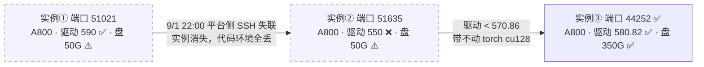
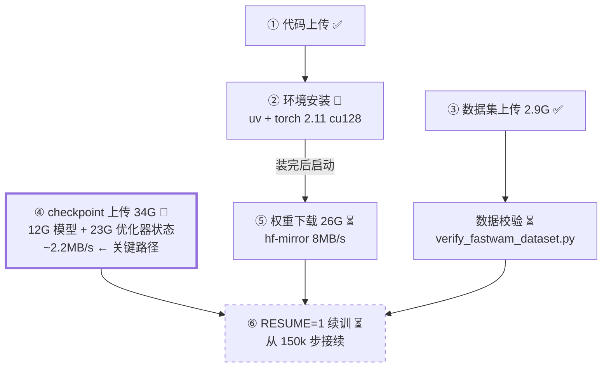
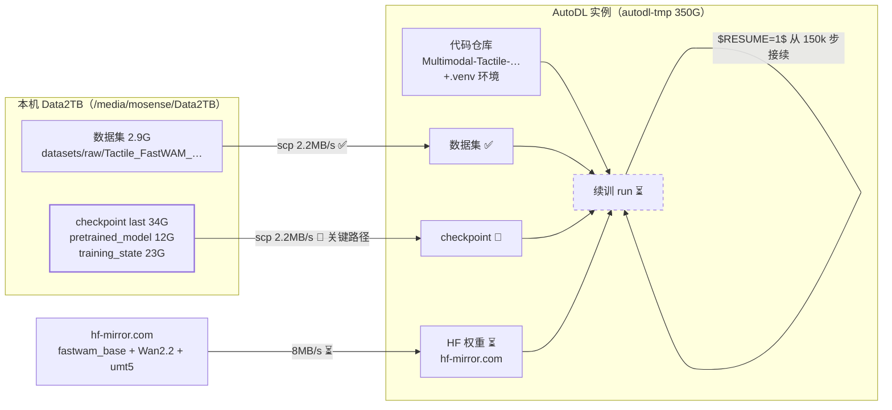

# AutoDL 续训执行日志（✅ 续训已启动，2026-09-02 17:08）

> 目标：在云端续训 FastWAM 触觉 checkpoint（15 万步 → 更多步），避免与本机 LingBot 抢 GPU。
> 本文档记录实际执行进度，与 AUTODL_RESUME_GUIDE.md（方案）、AUTODL_RESUME_REPORT.md（完成报告）配套。
>
> **当前状态：续训运行中。107K/150K（18:56 快照），实测 ~3.1s/step，预计 9/4 上午 9:00-11:00 完成。详见下方「监控快照与决策记录」。**

---

## 当前服务器（第 3 台，最终版）✅

```
ssh -p 44252 root@connect.nma1.seetacloud.com   # 免密已配置
```

| 项 | 值 | 达标 |
|---|---|---|
| GPU | A800 80GB PCIe | ✅ |
| 驱动 | 580.82.07（≥570.86）| ✅ cu128 可用 |
| 数据盘 | **350G**（/root/autodl-tmp）| ✅ 充裕 |
| 内存/CPU | 1007G / 112 核 | ✅ |
| 镜像 | miniconda3 + Python 3.12.3 + torch 2.5.1+cu124（base）| setup 脚本会另建 venv 装 torch 2.11 |

**实例更换历史**（SeetaCloud 每次重开机换端口换密码，root@connect.nma1.seetacloud.com 不变）：



1. ~~端口 51021：驱动 590 ✅ 但数据盘仅 50G；9/1 晚 22 点 SSH 断开，实例消失~~
2. ~~端口 51635：驱动 550 ❌（<570.86，cu128 不达标），数据盘 50G；已弃用~~
3. **端口 44252：全达标，当前使用**（密码每次变，见控制台）

---

## 五步流程进度（✅ 全部完成，2026-09-02 17:17 快照）

| # | 任务 | 大小 | 状态 | 备注 |
|---|---|---|---|---|
| ① | 代码上传 | 310M | ✅ 完成 | GitHub 直连不通（ghfast.top 镜像也超时），改用 `git archive` 打包 scp |
| ② | 环境安装 | ~8G | ✅ 完成 15:16 | torch 2.11.0+cu130 装好，CUDA 冒烟测试通过 |
| ③ | 数据集上传 | 2.9G | ✅ 完成 | `datasets/raw/Tactile_FastWAM_Insert_The_Cylinder` 已就位 |
| ④ | checkpoint last 上传 | 34G | ✅ 完成 | 12G 模型 + 23G 优化器状态，`du -sh` 核对一致 |
| ⑤ | 权重下载 | ~26G | ✅ 完成 15:49 | hf-mirror.com 8MB/s，fastwam_base 12G + Wan2.2 14G + umt5 |
| ⑥ | 续训启动 | — | ✅ **17:08 启动** | `RESUME=1 bash scripts/autodl/train_fastwam_tactile.sh`，GPU 100%，loss 0.26→0.18 |

**任务依赖与关键路径**（三线并行，checkpoint 上传是最长杆）：



**服务器目录布局**：
- 代码：`/root/autodl-tmp/Multimodal-Tactile-Sensing-for-Embodied-AI/`（venv 在其下 `.venv/`）
- 数据/输出：`/root/autodl-tmp/mosense-lerobot/`（`datasets/raw/...` 与 `outputs/checkpoints/...`）

**本地源**（Data2TB 数据盘，勿动）：



---

## 关键坑与经验

1. **SeetaCloud 实例不稳定**：第一台一晚上 SSH 就没了（平台侧问题），代码/环境全丢。务必 **nohup + setsid** 在服务器本地跑长任务；关键进度本地留档。
2. **每台实例密码不同**：旧密码不能复用，新实例要重新装免密公钥（本地 `~/.ssh/id_ed25519.pub`）。
3. **GitHub 服务器直连不通**：连镜像也不稳。代码用 `git archive HEAD` 打 tar.gz（310M，不含 .git）scp 上去最快。
4. **scp 目录必须 `-r`**：传 checkpoint 目录忘了 `-r` 会报 "not a regular file"。
5. **pip 阿里云源速度看实例**：第一台 130KB/s，这台 1.7MB/s——慢别急着换源，先实测。
6. **hf-mirror 权重下载**：resolve 大文件会 302 到 us.aws.cdn.hf.co（xet CDN），实测 8MB/s，26G 约 1h。
7. **驱动是硬门槛**：torch cu128 需驱动 ≥570.86。第二台 550 驱动直接不合格，选实例先看驱动版本。
8. **checkpoint 结构**：每个 step 目录 = pretrained_model(12G) + training_state(23G) 共 34G；`last` 是指向 step 目录的软链接；续训必须带 training_state（优化器状态）。

---

## 训练参数备忘（train_fastwam_tactile.sh 默认值）

- RUN_NAME：`Tactile_FastWAM_Insert_The_Cylinder_h10_b8_s150000`（上传目录名必须与之一致才能 RESUME 找到）
- SAVE_FREQ=5000（每 5 千步存 34G，350G 盘约可存 9 个，注意清理）
- 续训：`RESUME=1`，从 `last/pretrained_model/train_config.json` 读配置，`--resume=true` 接着 15 万步往上训

## 下一步（训练完成后，预计 9/4 上午）

1. 确认 150K 完成：`grep 'step:' /root/train.log | tail`，并看 W&B 曲线
2. 下载最终 checkpoint（只需 pretrained_model 12G）
3. 跑 eval 扩展评测（adjust_bottle 5/5 基础上）
4. 清理服务器：删中间 checkpoint、关机/无卡模式停止计费
5. 收尾更新 AUTODL_RESUME_REPORT.md 与本文档

---

## 监控快照与决策记录

### ⚠️ 事故记录：21:08 首个 checkpoint 后训练崩溃（9/3 早发现并修复）

**时间线**：
1. 21:08:52 — step 110000 checkpoint 保存成功（34G 完整：pretrained_model 12G + training_state 23G）
2. 21:08:52 — lerobot `update_last_checkpoint()` 尝试把 `last` 改为指向 `110000` 的软链接 → **`FileExistsError: 'last' 已存在`**（我们上传的是实体目录，不是软链）→ 异常未捕获，**训练进程直接退出**
3. 21:08 ~ 9:10（次日）— GPU 空转约 12 小时（按 ¥7.5/h 约 ¥90 损失）
4. 9:10 — 定时清理任务发现；深查 `train.log` 定位根因
5. 9:42 — 删除旧 `last`（105K 内容，本地有备份），创建 `last -> 110000` 软链——与 lerobot 期望的结构一致，此雷已排
6. 9:5x — 重启续训时踩第二个坑：`verify_fastwam_dataset.py` 默认期望 200 episodes/122594 帧，但数据集实际 280/175767（与本地 Data2TB 一致，非数据问题）——需带 `EXPECTED_EPISODES=280 EXPECTED_FRAMES=175767`
7. 带 `RESUME=1 EXPECTED_EPISODES=280 EXPECTED_FRAMES=175767` 重新启动，从 110K checkpoint 恢复

**根因**：上传 checkpoint 时用了**实体目录** `last`，而 lerobot 的 `update_last_checkpoint()` 只会 unlink 软链再建软链，遇到实体目录抛 FileExistsError。**教训：以后上传 resume checkpoint，应上传成 `checkpoints/<step>/` 目录 + 手动建 `last -> <step>` 软链，不要直接放实体 last 目录。**

**损失评估**：约 12h GPU 空转（~¥90）+ 完成时间推迟 12h 至 **9/4 深夜~9/5 早**。无数据/进度损失（110K checkpoint 完整，从 110K 恢复）。

### 2026-09-02 18:56 快照（启动后 1h48m）

| 指标 | 值 | 说明 |
|---|---|---|
| 步数 | **107K** / 150K | 从 105K 起推进 ~2K 步 |
| loss | **0.155 ~ 0.19** | 持续下降（17:10 起步 0.26），梯度范数 1.5~1.8 收窄 |
| GPU | 96% util · 62°C · 255W | 满载稳定 |
| 显存 | 75.6G / 80G | 无波动 |
| 磁盘 | 67G / 350G（20%）| 尚未写新 checkpoint |

**速度修正**：实测 ~3.1s/step（含写盘开销摊薄），比启动时估的 2.84 慢；加 8-9 次写盘（34G/次，10-20 分钟/次），**完成时间修正为 9/4 上午 9:00-11:00**。

### 已识别风险：磁盘将在最后一步写满

- 剩余 284G，110K→150K 共 9 个新 checkpoint × 34G = **306G → 装不下**
- 写完 145K 后仅剩 ~10G，**写 150K 最后一个 checkpoint 时几乎必然磁盘满、训练在终点前崩溃**
- 解法：110K 落盘且 `last` 改指后（预计今晚 ~21:30），删除服务器上的 105K 旧 checkpoint（本地 Data2TB 有完整备份）

### 用户决策（2026-09-02 晚）

1. **磁盘清理**：✅ 同意自动清理 105K 旧 checkpoint（等 110K 落盘后执行）
2. **训完自动关机**：❌ 否——**保持开机**，用户要亲自确认后再处理（代价：多空转几小时 ≈ ¥8/h）

### 自动化监控安排

| 时间 | 动作 | 结果 |
|---|---|---|
| 9/2 21:23 | 检查 110K checkpoint 落盘 → 删旧 105K → 回帖汇报 | ⚠️ 发现 21:08 训练已崩（见事故记录），清理同时排掉软链雷，9/3 早修复重启 |
| 9/3 8:07 | 生成晨报 | ⏳ 待执行（用户 9 点后到场，正好覆盖事故汇报）|

> 注意：定时任务在 Claude Code 会话内运行，**今晚不能关掉该会话窗口**（不影响服务器训练，训练在 nohup 下）。

### 明早 9 点用户到场时的思考清单（预演）

- **场景 A 还在冲刺（最可能）**：loss 是否仍降；磁盘余量（若昨晚清理失败立即删旧）；等收尾 vs 先干别的
- **场景 B 已完成**：① `du -sh` 确认 150K 完整 34G、`last` 指向 150000；② 保持开机（已决策），确认后手动关机；③ 下载计划——只需 pretrained_model 12G（scp ~1.5h），training_state 23G 视是否还要续训；④ 评测方案：云端评（GPU 热着、免重传）vs 本地评（lingbot 占 31G，推理 60G 够）；评什么：105K vs 150K 对比、扩展 adjust_bottle 外任务；⑤ W&B 截图存档、更新报告
- **场景 C 崩了/实例失联**：磁盘满 → 删旧 → `RESUME=1` 重启（最多损失一个 checkpoint）；实例消失 → 控制台重开（端口密码都变，免密公钥重装）→ 数据盘还在 → 重装环境 resume；loss 发散 → 回滚 145K
- **性价比视角**：到明早总花费 ≈ 40h × ¥7.5 ≈ ¥300；空转 4h = +¥30；150K 模型下一步去向（eval / demo 视频 / 归档）决定是否立刻下载
