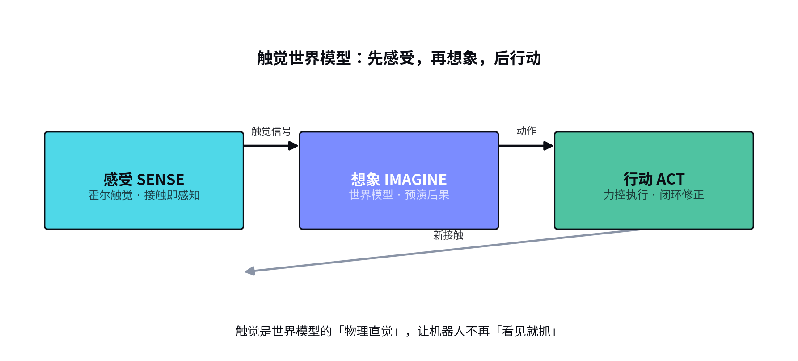
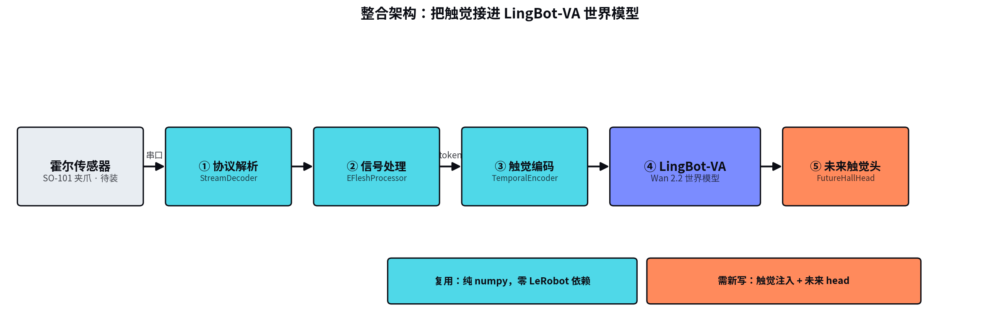

# MoSense 触觉项目 · 全局沉淀文档

> 一页看懂：代码质量现状、硬件/数据现状、整合方向、战略判断、下一步行动。
> 关联详细文档：[INTEGRATION_PLAN.md](INTEGRATION_PLAN.md)（整合方案）、[STRATEGY_EVALUATION.md](STRATEGY_EVALUATION.md)（战略评估）、[TRAINING_GUIDE.md](TRAINING_GUIDE.md)（训练指南）。

---

## 1. 项目全景

| 维度 | 现状 | 关键结论 |
|---|---|---|
| **代码质量** | 5 个 bug（见 §2）| 1 个正确性 bug 待修 |
| **硬件** | 传感器/机械臂/GPU 齐（见 §3）| 本机可训，但 GPU 被 LingBot 占用 |
| **数据** | 只有测试集，缺训练集 + 权重（见 §3）| 需下载/找回 |
| **整合方向** | LingBot-VA × Tactile（见 §4）| 触觉条件的世界模型 |
| **战略** | 触觉世界模型是 2026 风口（见 §5）| 差异化：低成本霍尔 + SOTA 世界模型 |

---

## 2. 代码审查结论（来自 Issue #3，5 个 bug）

| 严重度 | 问题 | 位置 | 说明 |
|---|---|---|---|
| 🔴 高 | Action 特征被标成 STATE | `robot_kinematic_processor.py:516` | 末端 action（ee.x/y/z…）写成 `FeatureType.STATE`，应为 `ACTION`，导致 action schema 错误 |
| 🟠 中 | 串口读线程无异常保护 | `mosense_hall.py:199` | `serial.read()` 无 try/except，USB 拔了线程静默失效，`is_connected` 仍 True |
| 🟠 中 | `.copy()` 在 None 判断前 | `robot_kinematic_processor.py:80/314/394` | `None.copy()` 抛 AttributeError，掩盖真实原因 |
| 🟡 低 | 传感器模块重复协议代码 | `mosense_hall.py` vs `adapters/mosense_hall.py` | 协议解析逐字节重复，改动会漂移 |
| 🟡 中低 | 特征命名不一致 | `lerobot_integration.py:34` | `tactile.*` vs `observation.tactile`，可能静默丢特征 |

**修复建议**：先修 1+3+2（小改动、低风险），4（去重）和 5（命名统一）改动面大、涉及 checkpoint 兼容，需确认后再动。

---

## 3. 硬件 / 数据现状

### 硬件（本机已齐）

| 硬件 | 状态 |
|---|---|
| GPU | ✅ RTX PRO 6000 Blackwell 96GB（但被 LingBot 占 31GB，剩 60GB）|
| 触觉传感器 | ✅ `/dev/ttyUSB0` 已接入 + 校准文件 `eflesh_calibration.json` |
| 机械臂 | ✅ `/dev/ttyACM0`（+ACM1）|
| 相机 | 前端 `/dev/video0` + 顶部 `/dev/video2` |

### 数据 / 权重（缺失）

| 项 | 状态 | 来源 |
|---|---|---|
| 训练数据集 `Insert_The_Cylinder` | ❌ 本地无 | 需找回数据盘或重采 |
| 预训练权重 `pretrained_fastwam_move_pen` | ❌ 本地无 | HF `lerobot/fastwam_base` 可下载 |
| 测试集 `Tactile_FastWAM_test` | ✅ 有 | 本地 |

---

## 4. 整合方案要点（详见 INTEGRATION_PLAN.md）



**目标**：把 MoSense 霍尔触觉接进 LingBot-VA（Wan 2.2 世界模型），实现「触觉条件的世界模型」。

```
传感器（已接入）→ 协议解析（复用）→ 信号处理（复用）→ 触觉 token → LingBot-VA → 未来触觉头
```

- 核心代码（协议 + 信号处理 + 标定）纯 numpy，**直接复用**；
- 只需新写「触觉注入 + 未来 head」；
- 分阶段：硬件 → 代码打通 → Level 0（触觉条件）→ Level 1（co-training）。



---

## 5. 战略判断（详见 STRATEGY_EVALUATION.md）

- **方向正确**：触觉世界模型是 2026 具身智能主战场，戴盟（蚂蚁领投）、千觉、智在无界等密集进场；
- **差异化**：不打通用大模型军备竞赛，打「低成本霍尔触觉 + LingBot-VA SOTA 世界模型」的性价比路线，聚焦「视觉遮挡下精细操作」；
- **风险**：触觉数据采集贵、通用化难、硬件安装是当前卡点。

---

## 6. 行动清单（按优先级）

1. **修代码 bug**：Issue #3 的 🔴 #1（Action→STATE）+ 🟠 #3（死代码）+ 🟠 #2（串口容错），小改动先修；
2. **下载预训练权重**：`huggingface-cli download lerobot/fastwam_base --local-dir pretrained_fastwam_move_pen`；
3. **找回训练集**：确认 Data2TB 数据盘能否挂回，找回 `Insert_The_Cylinder`，否则重采；
4. **训练**：AutoDL 租 A100/H100-80G，跑 `train_fastwam_tactile.sh`（避免与本机 LingBot 抢 GPU）；
5. **整合 LingBot-VA**：按 INTEGRATION_PLAN 阶段推进（触觉 token 接入 Wan）。

---

## 7. 相关文档索引

- [INTEGRATION_PLAN.md](INTEGRATION_PLAN.md) — LingBot-VA × Tactile 整合方案（含架构图）
- [STRATEGY_EVALUATION.md](STRATEGY_EVALUATION.md) — Vision-Action-Tactile 战略评估（含行业调研）
- [TRAINING_GUIDE.md](TRAINING_GUIDE.md) — FastWAM 触觉训练启动指南
- [README.md](README.md) — 触觉 LeRobot fork 代码分析总结
