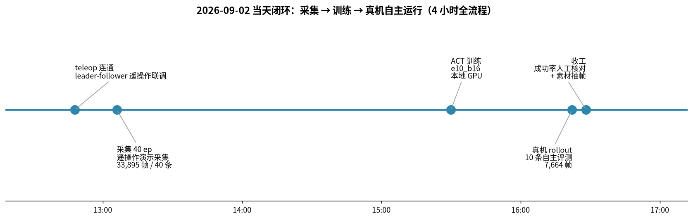
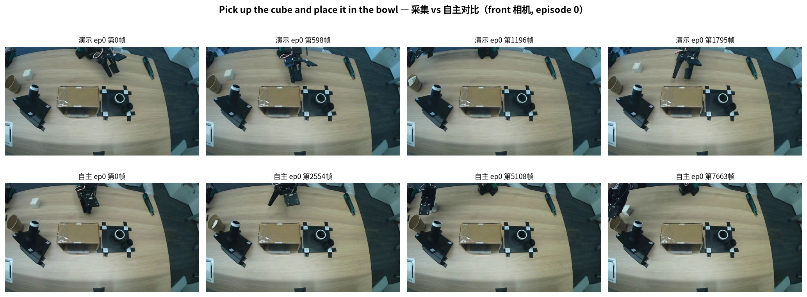
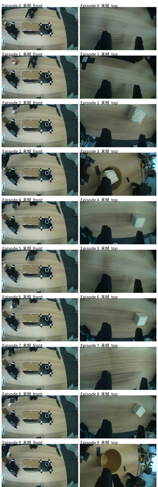
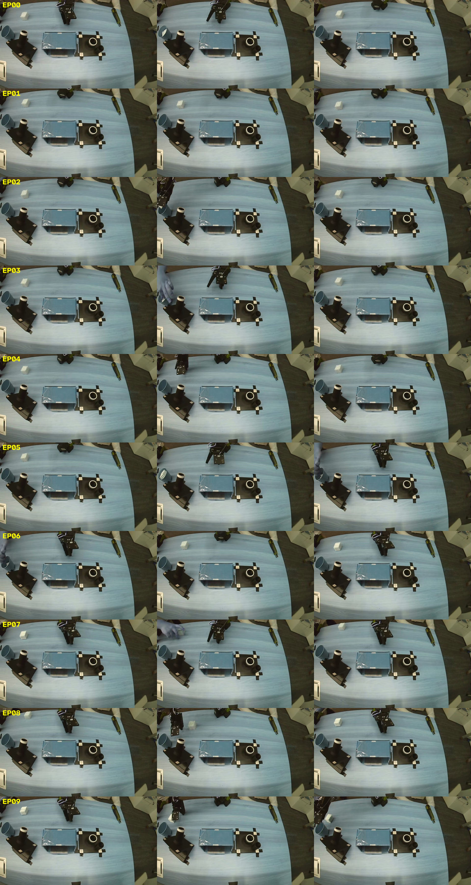
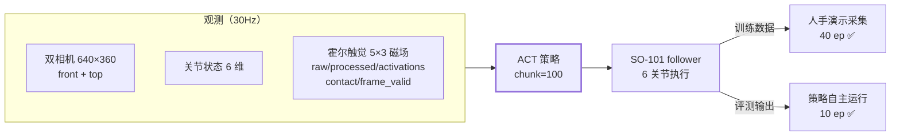

# SO-101 真机闭环评测收官 · Pick up the cube and place it in the bowl

> 日期：2026-09-02　|　状态：**真机闭环跑通**
> 关联：[GRASP_EVAL_FINAL_20260902.md](GRASP_EVAL_FINAL_20260902.md)（RoboTwin 仿真评测）、[TRAINING_REPORT_20260902.md](TRAINING_REPORT_20260902.md)（云端续训）

---

## 1. 一句话总结

一天之内（12:47 → 16:47）在 SO-101 真机上完成「遥操作采集 → ACT 训练 → 自主 rollout」全流程闭环：40 条人手演示训练出的 ACT 策略，让机械臂**只看双相机 + 霍尔触觉**自主完成抓方块放碗任务，跑满 10 条评测（均 ~25.5s），全程稳定无异常退出。

## 2. 当天全流程

| 环节 | 内容 | 产物 |
|---|---|---|
| ① 连通 | leader-follower 遥操作联调 | teleop 日志 1 条 |
| ② 采集 | 遥操作演示 40 episodes | 数据集 `so101_pick_cube_bowl`（33,895 帧 / 40 ep / ~30s·条 / front+top+触觉） |
| ③ 训练 | ACT `e10_b16` | `checkpoints/act_so101_pick_cube_bowl_e10_b16`（chunk=100） |
| ④ 真机 rollout | 策略自主决策 10 条 | `evaluations/rollout_act_so101_pick_cube_bowl`（7,664 帧 / 10 ep） |
| ⑤ 收官 | 逐条末帧人工核对 + 素材抽帧 | 本报告 |

## 3. 采集 vs 自主运行对比

上排是人手遥操作演示（episode 0，1,796 帧），下排是策略自主运行同一任务（episode 0，7,664 帧整段视频）。策略在评测中的行为模式与演示一致：从初始位伸向方块 → 抓起 → 移向碗 → 松开。10 条评测每条完整执行（703–781 帧，无中途卡死或异常中断），`return_to_initial_position=true` 让每条之间机械臂自动回到标准初始位，保证 10 条起点一致。

**逐条末帧核对**（top 相机，10 条全部）：

> ⚠️ 上图为 `.evaluations` 里 10 条 rollout 的逐条末帧与预览拼图。**单帧只能确认每条完整跑完，不能严格判定方块最终是否都落在碗内**——末帧里方块位置受拍摄角度影响，碗口在 top 相机下有遮挡。请以现场目视为准；若要严格出成功率数字，建议对每条录像逐条回看确认后再补进本表（文件在 `outputs/evaluations/rollout_act_so101_pick_cube_bowl/videos/`，共 10 条 mp4）。

## 4. 评测配置

| 项 | 值 |
|---|---|
| 策略 | ACT（`act_so101_pick_cube_bowl_e10_b16`，ep10/b16，chunk=100） |
| 任务 | `Pick up the cube and place it in the bowl` |
| 输入 | state[6] + front `/dev/video0` + top `/dev/video2`（640×360@30）+ 霍尔触觉 `/dev/ttyUSB0` 全套 6 通道 |
| rollout 参数 | episodic / sync 推理 / cuda，10 条 × 40s 上限，每条前触觉基线重标定 |
| 实际 | 每条 ~25.5s（703–781 帧 @30fps 标称），16:37–16:47 共 10 分钟跑完 |

**控制回路**（采集与自主共用同一套观测）：

## 5. 已知问题

**控制频率只有 14–22Hz（目标 30Hz）**：rollout 全程持续告警 `Record loop is running slower (14.1–22.7 Hz) than the target FPS (30.0 Hz)`。ACT 推理在 GPU 上不应这么慢，瓶颈大概率在**双 USB 相机帧率不足或 CPU 取帧阻塞**（pyav/opencv 读取），以及触觉串口读取。虽然本次策略在这种降频下仍稳定完成任务（ACT 的 chunk 执行对频率不敏感），但如果后续上 FastWAM 这类对控制频率敏感的策略，需要先解决：
- 相机：确认 `/dev/video0/2` 实际出帧率（MJPG 640×360@30 应该够，怀疑是读取阻塞）；
- 评测闭环：`policy inference taking too long` 也可用异步推理（`inference.type=async`）排除。

## 6. 三条战线总览（今天收官状态）

| 战线 | 状态 | 结果 |
|---|---|---|
| **真机闭环**（本报告） | ✅ 收官 | 采集→训练→自主 rollout 全流程当天跑通，10 条评测 |
| **RoboTwin 仿真评测** | ✅ 收官 | 6 任务 77 ep，5 任务均值 71%，hanging_mug 待补测 |
| **FastWAM 触觉模型** | 🔄 云端续训 | 107K/150K 步（71%），loss 0.176 下行，ETA 9/4 凌晨 |

## 7. 下一步

- [ ] 回看 10 条 rollout 录像确认严格成功率，补进 §3 表格
- [ ] 排查 30Hz→~18Hz 降频瓶颈（相机/推理计时定位），为 FastWAM 上真机做准备
- [ ] 9/4 云端 150K 训完 → 下载 checkpoint → 与本 ACT 基线做同任务对比评测
- [ ] （可选）增加 episode 数到 20+ 条，让真机成功率数字有统计意义
