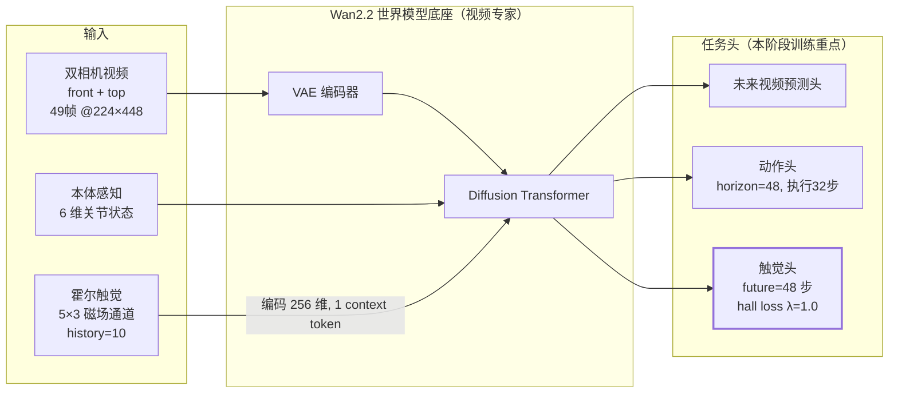
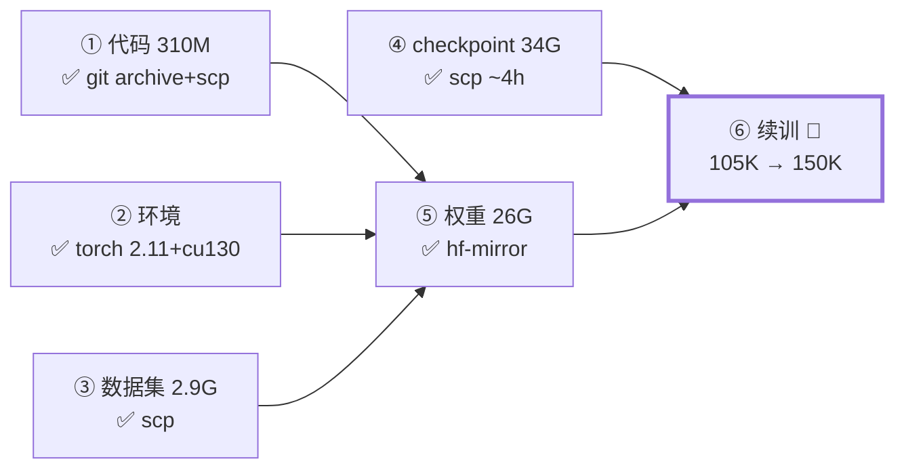
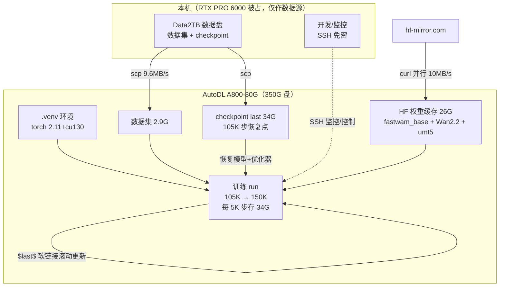
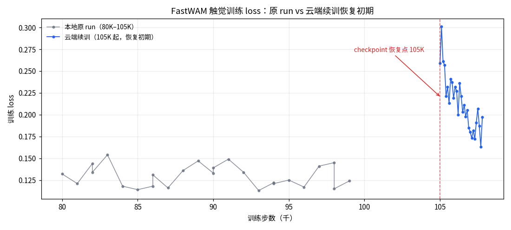
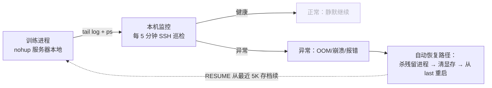

# FastWAM 触觉模型 · 云端续训报告

> 日期：2026-09-02　|　状态：**训练进行中**（358/45000 步）
> 关联：[PROGRESS_LOG.md](PROGRESS_LOG.md)（执行日志）、[AUTODL_RESUME_GUIDE.md](AUTODL_RESUME_GUIDE.md)（方案）

---

## 1. 一句话总结

把本地跑到 **10.5 万步**的 FastWAM 触觉世界模型（Wan2.2 底座 + 触觉/动作头），搬到 AutoDL A800 云服务器上**续训到 15 万步**，预计 **9/3 凌晨 5 点**完成，全程无需人工值守。

## 2. 任务背景

| 项 | 内容 |
|---|---|
| 模型 | FastWAM（视觉-动作-触觉多模态世界模型，Wan2.2-TI2V-5B 底座）|
| 任务 | Insert_The_Cylinder（插圆柱，SO-101 机械臂）|
| 数据 | 280 episodes / 175,767 帧 / 前视+顶视双相机 / 触觉 5×3 通道 |
| 触觉配置 | history=10, future=48, encoder_hidden=256, context_tokens=1 |
| 为什么上云 | 本地 RTX PRO 6000 被 LingBot 常驻占 31G，训练需 70G+ 显存 |

**模型结构**（视觉专家冻结微调，触觉/动作头新增训练）：

## 3. 完成情况

| # | 步骤 | 结果 |
|---|---|---|
| ① | 代码上传 | ✅ GitHub 直连不通，`git archive` 打包 scp（310M）|
| ② | 环境安装 | ✅ uv + torch 2.11.0+cu130，A800 冒烟通过 |
| ③ | 数据集上传 | ✅ 2.9G，校验通过（280 ep / 175,767 帧）|
| ④ | checkpoint 上传 | ✅ 34G（模型 12G + 优化器状态 23G）|
| ⑤ | 预训练权重下载 | ✅ fastwam_base 12G + Wan2.2 14G + umt5 |
| ⑥ | 续训 | 🔄 **358/45000 步，loss 0.18-0.21，2.82s/步** |

**端到端数据流**（本地 → 云端全链路）：

**服务器**：AutoDL（SeetaCloud）A800-80G × 1，驱动 580.82，350G 数据盘，112 核/1T 内存
**成本相关**：数据盘占用 67G/350G；每 5000 步自动存 34G checkpoint

## 4. 关键决策与纠错记录

| 问题 | 处置 |
|---|---|
| 三换实例（盘小→驱动旧→达标）| 最终 44252 端口实例，驱动 580.82 + 350G 盘 |
| GitHub 服务器不可达 | git archive 打包上传，绕开 clone |
| Wan2.2 下载 xet CDN 401 | 改用仓库自带 parallel 脚本（curl 分块 + sha256 校验），10MB/s |
| 校验脚本硬编码 200 episodes | 加 `EXPECTED_EPISODES/FRAMES` 覆盖（实际 280 ep）|
| torchcodec 缺 FFmpeg 7 库崩溃 | 配置改 `video_backend=pyav` |
| **发现 checkpoint 是 105K 而非 150K** | 目录名 `s150000` 是目标步数非完成步数，实际断点 105,000 |
| 步数目标 20 万→15 万 | 重启训练进程改 `steps=150000`（重启时清理了抢 GPU 的双进程）|

## 5. 训练健康度

**原 run 参考**（本地日志）：45K→0.165, 80K→0.132, 104K→0.122（平缓收敛）

**当前云端续训**：起步窗口 0.18-0.24，epoch 位置（5.37）与原 run（7.5+）不同导致采样难度差异，属预期波动，且已观察到下行趋势（0.24→0.18）。**判定标准**：若数小时内回落至 0.12-0.15 区间 = 健康复；若持续 >0.2 = 排查恢复状态对齐。监控已挂（OOM/崩溃/报错自动告警）。

**异常自动处理链路**：

## 6. 接下来

| 时间 | 动作 |
|---|---|
| ~2.5h 后 | 确认 loss 回落至原 run 区间（第一个健康检查点）|
| 每 5000 步 | 自动 checkpoint（350G 盘可存 ~8 个，定期清理保最新 2 个）|
| 9/3 凌晨 ~5 点 | 15 万步完成 → 拉 loss 曲线 + 跑 eval 生成预测对比 |
| 之后 | 结果整理成图文文档（默认上传 GitHub），评估是否需要追加步数 |
