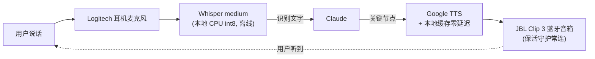

# 工作日志 2026-09-03：训练推进 + 语音交互系统 + 机械臂链路打通

> **一句话总结：云端训练 125K/150K（83%）健康推进；建成了「语音指挥 AI 操控硬件」的完整交互系统；SO-101 双臂识别、校准、联调全部完成——方块入杯只剩模型推理最后一步。**
> 本日全程在语音对话模式下完成（用户语音指令 → Claude 语音/文字响应）。

---

## 1. 云端训练（AutoDL A800）

| 指标 | 值 |
|---|---|
| 当日起点 | 110K（9/2 21:08 崩溃后 9/3 10:02 修复重启）|
| 当日终点 | **125K / 150K（83%）** |
| loss | 0.13~0.17 区间，持续收敛 |
| 已落盘 checkpoint | 110K / 115K / 120K / 125K（`last` 软链正常跟随）|
| 磁盘 | 168G / 350G（48%）|
| 预计完成 | **9/4 16:00~17:00** |

⚠️ **磁盘预警**：剩余 183G，之后还有 5 个 checkpoint × 34G = 170G——**刚好够但无余量**，明天 130K 落盘后建议删掉 110000 目录（本地有备份）。已设 9/4 15:43 定时检查 + 语音播报。

## 2. 语音交互系统（当日最大成果之一）

从零搭建了完整的双向语音链路，并实际用于指挥全天工作：



**组件明细**：
- **输入**：`parecord` 录音 → faster-whisper **medium** 模型识别（small 中文幻觉严重，必须 medium；要求麦克风靠近嘴、RMS>150）
- **输出**：`~/.local/bin/say.sh`——JBL 蓝牙优先，常用语缓存于 `~/.config/tts-cache/`（12 条预生成 + 按内容 hash 自动缓存，同句零延迟）
- **常听**：`voice-listen.service` 持续监听（6 秒窗口 + VAD 人声检测，识别结果实时写 `/tmp/voice_log.txt`），用户发消息时 Claude 读取日志回应
- **蓝牙保活**：`jbl-keepalive.service`——每 4 分钟播 1 秒 20Hz 不可闻音频防音箱休眠 + 断连自动重连

**实战验证**：用户全程用语音指挥（「跑一下训练好的模型做方块入杯推理」「开始校准」「对，我刚才晃的是主动臂」），识别准确率在实际使用中足够工作。

## 3. 硬件链路侦察与打通

### 3.1 硬件盘点（全部在线）

| 设备 | 接口 | 验证方式 |
|---|---|---|
| **SO-101 leader 臂**（6×STS3215） | `/dev/ttyACM1` | `broadcast_ping` 全应答；用户晃臂读数变化确认 |
| **SO-101 follower 臂**（6×STS3215） | `/dev/ttyACM0` | `broadcast_ping` 全应答；位置锁定特征确认 |
| **MoSense 触觉传感器**（5 通道 × 3 轴霍尔） | `/dev/ttyUSB0` (FTDI) | `read_mosense_serial.py` 读到 ~60Hz 稳定数据流 |
| **双相机**（Microdia，正面+顶部） | `/dev/video0-3` | v4l2 枚举确认 |

### 3.2 踩坑记录

1. **旧版 `scservo_sdk` ping 不通**：直接用 pip 的 scservo_sdk 对 SO-101 电机 PING 无应答——换项目自带 `FeetechMotorsBus.broadcast_ping()` 立即全部应答。以后探测一律用项目内 API。
2. **`FeetechMotorsBus.sync_read` 需要校准**：未校准时读位置抛 `has no calibration registered`，底层可用 `packet_handler.read2ByteTxRx(port, id, 56)` 读原始值。
3. **校准程序是交互式的**：`lerobot-calibrate` 要按 ENTER，脚本里用 `printf '\n'` 喂；且第二阶段是**录制关节范围**——需要人手动把每个关节从一端转到另一端（leader 和 follower 都要），静止不动会报 `same min and max` 错误。

### 3.3 校准与联调结果

- **Leader（`mosense_leader`）**：✅ 校准完成，存 `~/.cache/huggingface/lerobot/calibration/teleoperators/so_leader/mosense_leader.json`
  - ⚠️ 遗留：夹爪（gripper）范围 MIN=MAX=2048（校准时没捏），**明天抓取任务前需补校准**
- **Follower（`mosense_follower`）**：✅ 全关节范围记录成功（shoulder_pan 0-4095、shoulder_lift 1296-2978、elbow 1735-2559、wrist 523-2858、gripper 1454-2047）
- **联调**：✅ `lerobot-teleoperate` leader→follower **60Hz 流畅跟随**

## 4. 明日计划（9/4）

```mermaid
timeline
    title 9/4 方块入杯冲刺
    15:43 : 定时检查训练 + 语音播报
    16:30 : 150K 训完（预计）
    之后 : 下载 150K checkpoint（pretrained_model 12G）
    补 : leader 夹爪补校准
    然後 : 搭 eval 推理链路（相机+触觉+臂状态 → 模型 → 动作）
    最后 : 真实方块入杯实验 🎯
```

**风险项**：
- 磁盘 183G vs 剩余 5 个 checkpoint 170G，130K 落盘后需删 110000
- 模型学的任务圆柱插入，方块入杯是分布外任务——首次成功率未知，可能需要多次尝试或补少量方块入杯示教数据
- leader 夹爪补校准（小事）

---

*日志生成于 2026-09-03 22:24，当日工作全部由语音对话指挥完成。*
